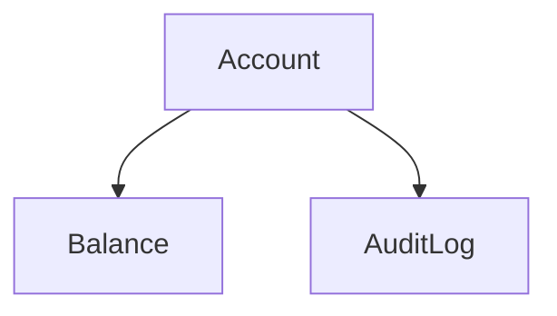

# CO.3 Case Study: Bank Account

## Mission

- Combine named-field composition and embedding in a complex domain model.
- Promote method sets from base types to specialized variants (Savings, Overdraft).
- Implement method shadowing to differentiate behavior at the parent level.
- Manage shared state through pointer receivers in composed hierarchies.

## Prerequisites

- `CO.1` Composition
- `CO.2` Embedding

## Mental Model

In financial systems, different account types often share a core set of attributes (account number, balance, owner) but require highly specialized logic for operations like withdrawals or interest calculations. This case study demonstrates how to build a flexible banking model by embedding a base `Account` struct into specialized types. By "shadowing" the `Withdraw` method in the `OverdraftAccount`, we can change the fundamental rules of the account while reusing the core data structure.

## Visual Model



## Machine View

When you call `ovdAcc.Withdraw()`, the Go compiler first checks if `OverdraftAccount` has a `Withdraw` method defined. Because it does, this method is invoked directly. If it did not, the compiler would check the embedded `Account` struct for the method. This process is known as **selector resolution**. Unlike traditional inheritance, there is no "super" or "base" call unless explicitly performed by referencing the embedded field (`oa.Account.Withdraw()`).

## Run Instructions
```bash
go run ./04-types-design/18-bank-account-project
```
## Solution Walkthrough

### The Base Account

The `Account` struct defines the shared state and standard deposit/withdrawal logic.

```go
type Account struct {
    AccountNumber string
    Balance       float64
}
```

### Specialization via Embedding

`SavingsAccount` embeds `Account` to gain its methods, then adds a domain-specific `AddInterest` method.

```go
type SavingsAccount struct {
    Account
    InterestRate float64
}
```

### Specialization via Shadowing

`OverdraftAccount` embeds `Account` but provides its own `Withdraw` implementation. This shadows the base method, allowing for a different business rule (negative balance support).

```go
func (oa *OverdraftAccount) Withdraw(amount float64) error {
    // Specialized overdraft logic
}
```

## Try It

### Automated Tests

```bash
go test ./...
```

## Verification Surface

- Attempt to withdraw more than the balance + overdraft limit and verify the error message.
- Add interest to a `SavingsAccount` and verify that the `Deposit` method was successfully promoted and called.

## In Production

- **Authentication Systems**: Specializing a base `User` struct into `Admin`, `Customer`, or `Guest` roles.
- **Inventory Management**: Creating specialized `Product` types (Perishable, Fragile, Digital) from a base inventory item.
- **Game Development**: Building specialized game entities (Player, NPC, Enemy) from a base `Actor` struct with shared position and health.

## Thinking Questions

1. How does method shadowing allow you to "override" behavior without the complexity of a virtual table?
2. Why is it important to use pointer receivers when modifying the `Balance` in a composed struct?
3. What would happen if you tried to access a field that exists in both the parent and the embedded struct?

## Next Step

Next: `ST.1` -> [`04-types-design/19-strings`](../19-strings/README.md)
