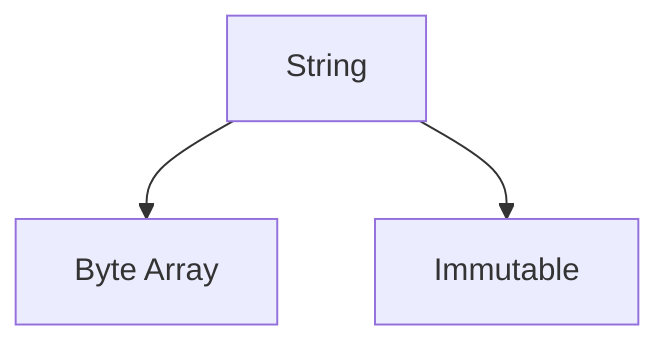

# ST.1 Strings

## Mission

- Understand string immutability and the underlying byte-slice representation.
- Utilize the `strings` package for efficient text transformation.
- Leverage `strings.Builder` to avoid O(n^2) concatenation performance traps.
- Master search, split, join, and replacement operations.

## Prerequisites

- `CO.3` Bank Account Project

## Mental Model

In Go, a **string** is an immutable sequence of bytes. Unlike languages that allow in-place modification of string characters, any operation that "changes" a Go string actually creates a new string in memory. This immutability provides safety and allows strings to be shared across goroutines without locking, but it requires careful handling to avoid excessive allocations. The `strings` package provides the standard library tools for high-performance text processing.

## Visual Model



## Machine View

Internally, a string is a 2-word header consisting of a pointer to the underlying byte array and the length of the string. Because strings are immutable, the underlying byte array can be shared between multiple strings (e.g., when taking a slice of a string). However, modifying a string requires allocating a new byte array and copying the content. This is why `s += "new text"` in a loop is highly inefficient—each iteration performs a full copy of the accumulated text.

## Run Instructions

```bash
go run ./04-types-design/19-strings
```

## Code Walkthrough

### Normalization

The `strings` package provides tools to clean and normalize raw input data.

```go
input := "  Username  "
clean := strings.TrimSpace(strings.ToLower(input)) // "username"
```

### Efficient Concatenation

`strings.Builder` maintains an internal, growing byte slice to minimize allocations.

```go
var b strings.Builder
for _, s := range parts {
    b.WriteString(s)
}
result := b.String()
```

### Tokenization

`strings.Fields` is often superior to `strings.Split` for parsing logs or CLI input as it collapses multiple whitespace characters.

```go
tokens := strings.Fields("word1    word2") // ["word1", "word2"]
```

## Try It

### Automated Tests

```bash
go test ./...
```

### Manual Verification

- Build a complex string using both `+` concatenation and `strings.Builder` in a loop of 10,000 iterations.
- Observe the performance difference (though benchmarking is covered in a later section, the latency is often visible).

## In Production

- **Log Parsing**: Splitting and filtering structured text logs.
- **API Request Normalization**: Trimming and case-converting headers or query parameters.
- **SQL Query Building**: Dynamically constructing complex queries (though parameterized queries are preferred for safety).

## Thinking Questions

1. Why does string immutability make Go programs more predictable in concurrent environments?
2. When should you prefer `strings.Split` over `strings.Fields`?
3. How does the internal byte-array sharing work when you take a slice of a string (e.g., `s2 := s1[0:5]`)?

## Next Step

Next: `ST.2` -> [`04-types-design/20-formatting`](../20-formatting/README.md)
