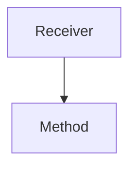

# TI.2 Methods

## Mission

- Associate behaviors with named types using method receivers.
- Differentiate between **Value Receivers** and **Pointer Receivers**.
- Understand Go's automatic dereferencing and address-taking (syntactic sugar).

## Prerequisites

- `TI.1` Structs

## Mental Model

A **Method** is a function that is attached to a specific type via a "Receiver". This allows data and the logic that operates on it to be grouped together, enhancing cohesion and satisfying the principle of encapsulation.

## Visual Model



## Machine View

In Go, methods are transformed by the compiler into regular functions where the receiver is the first parameter.

- **Value Receiver** `(c Circle)`: The compiler passes a copy of the struct. The method operates on this copy, meaning any modifications are local to the function's stack frame and do not affect the caller's value.
- **Pointer Receiver** `(c *Circle)`: The compiler passes the memory address of the struct. The method follows this pointer to modify the original data in memory.

**Syntactic Sugar**: Go automatically handles the conversion between values and pointers for method calls. If you call a pointer method on a value, Go implicitly takes its address (`&c`). If you call a value method on a pointer, Go implicitly dereferences it (`*ptr`).

## Run Instructions

```bash
go run ./04-types-design/2-methods
```

## Code Walkthrough

- **Value Receiver**: Used for read-only operations or for very small, immutable-like structs.
- **Pointer Receiver**: Used for mutation or to avoid the overhead of copying large structs.
- **Consistency Rule**: If *any* method on a type requires a pointer receiver, *all* methods on that type should use pointer receivers. This prevents confusion regarding which methods can be used with which receiver sets.

> [!NOTE]
> Methods are the mechanism through which Go satisfies [TI.3 Interfaces](../3-interfaces/README.md).

## Try It

1. In `main.go`, implement a `Reset()` method for `BankAccount` that sets the `Balance` to 0.
2. Confirm that a pointer receiver is required for the change to persist.
3. Test calling `Reset()` on both a `BankAccount` value and a `*BankAccount` pointer.

## In Production

- **State Mutation**: Updating the status or properties of a domain entity.
- **API Definition**: Implementing standard library interfaces like `fmt.Stringer` or `io.Reader`.
- **Middleware**: Attaching logic to a request context or configuration struct.

## Thinking Questions

1. Why does Go differentiate between value and pointer receivers instead of passing everything by reference like Java?
2. If a struct is very small (e.g., 2 integers), is there a performance benefit to using a value receiver?
3. How do methods improve the readability of code compared to standalone functions?

## Next Step

Next: `TI.7` -> [`04-types-design/7-receiver-sets`](../7-receiver-sets/README.md)
