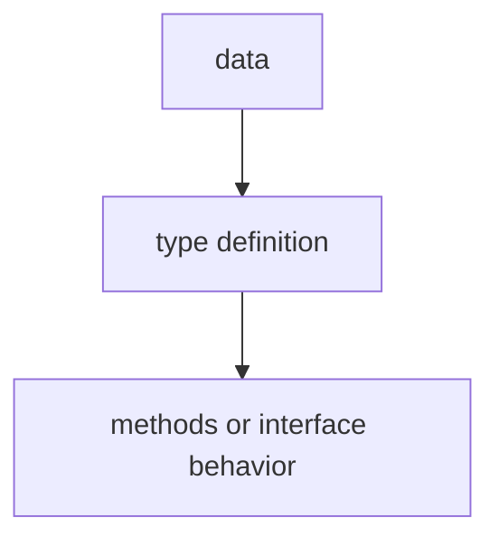

# TI.2 Methods

## Mission

Learn how to attach functions to types using methods, and understand the critical difference between value receivers and pointer receivers.

## Why This Lesson Exists Now

Now that you can group data with structs, the next question is: "How do I add behavior to that data?"

In other languages, you might use classes. In Go, you use methods-functions that are attached to a specific type. The key decision is whether to use a value receiver (works on a copy) or a pointer receiver (works on the original).

> **Backward Reference:** In [Lesson 1: Structs](../1-struct/README.md), you learned how to group related data. Methods take that one step further by allowing you to define behavior that is physically attached to those data groups.

## Prerequisites

- `TI.1` structs

## Mental Model

Think of a TV remote. The remote (struct) has state: volume level, current channel, power status. The buttons on the remote are methods. Some buttons read the state (volume display), others modify it (volume up). The receiver type determines whether you are reading or modifying.

## Visual Model


```text
+-------------------------------------------+
| Circle struct                             |
|   Radius float64                          |
+-------------------------------------------+
| Methods:                                  |
|   Area()      -> value receiver (read)    |
|   Perimeter() -> value receiver (read)    |
|   Scale()     -> pointer receiver (write) |
+-------------------------------------------+
```

## Machine View

A value receiver receives a copy of the struct. Any modifications inside the method do not affect the original.

A pointer receiver receives a pointer to the original struct. Any modifications inside the method affect the original.

Go automatically handles the dereferencing, so you can call `c.Scale(2)` on a Circle value, and Go automatically converts it to `(&c).Scale(2)`.

## Run Instructions

```bash
go run ./04-types-design/2-methods
```

## Code Walkthrough

### `func (c Circle) Area() float64 {`

This defines a method on Circle. The receiver `(c Circle)` is like an implicit first parameter. `c.Area()` is equivalent to `Area(c)` but reads better.

### Value receiver: `func (c Circle) Area()`

Used when the method only reads data (does not modify the struct) or when the struct is small.

### Pointer receiver: `func (c *Circle) Scale(factor float64)`

Used when the method modifies the struct, or when the struct is large (expensive to copy).

### The golden rule

If any method on a type needs a pointer receiver, make all methods on that type use pointer receivers for consistency.

## Try It

1. Add a `Reset()` method to BankAccount that sets Balance to 0.
2. Call it using a value type and observe that it does not work (the balance is unchanged).
3. Change the receiver to a pointer and try again.

## Common Questions

- When should I use value receivers?
  When the method only reads data and does not modify the struct.

- Why does Go allow calling pointer methods on values?
  Go automatically takes the address when needed. It is syntactic sugar.

## In Production
Methods are how Go achieves encapsulation. The receiver type determines whether callers get a copy or share the original. This affects performance and mutation behavior.

## Thinking Questions
1. What problem is this lesson trying to solve?
2. What would change if you removed this idea from the program?
3. Where do you expect to see this pattern again in real Go code?

> **Forward Reference:** Methods are the "behavior" of a type. When multiple types share the same method signatures, they can be treated as the same type through an **Interface**. In [Lesson 3: Interfaces](../3-interfaces/README.md), you will learn how to write generic code that works across any type that implements a specific method set.

## Next Step

Continue to `TI.3` interfaces.