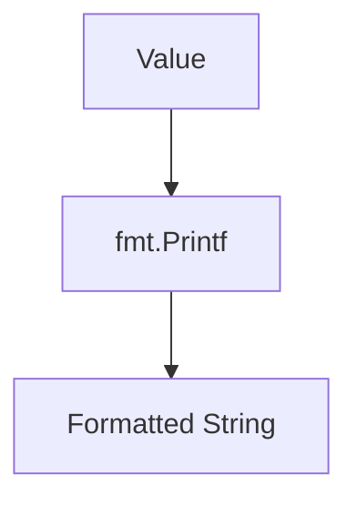

# ST.2 Formatting

## Mission

- Utilize `fmt` verbs for type-specific and general value formatting.
- Control width, precision, and alignment for tabular output.
- Implement error wrapping using the `%w` verb for context propagation.
- Understand the differences between `Printf`, `Sprintf`, and `Fprintf`.

## Prerequisites

- `ST.1` Strings

## Mental Model

Formatting is the process of transforming internal data structures into human-readable text. The `fmt` package uses template strings containing **verbs** (placeholders starting with `%`) that dictate how subsequent arguments should be rendered. This template-driven approach allows for precise control over numeric precision, string quoting, and structural representation (like printing struct field names).

## Visual Model



## Machine View

When a `fmt` function is called, the package uses reflection (`reflect`) to inspect the type and value of each argument. It then matches these against the provided verbs. While this reflection-based approach is highly flexible, it does incur a small runtime cost. For high-performance logging or hot loops, developers sometimes use specialized libraries, but `fmt` remains the robust standard for the vast majority of Go applications.

## Run Instructions

```bash
go run ./04-types-design/20-formatting
```

## Code Walkthrough

### General Verbs

- `%v`: The default format for any value.
- `%+v`: Adds field names when printing structs.
- `%#v`: Prints the value in Go syntax (useful for debugging).
- `%T`: Prints the type of the value.

### Type-Specific Verbs

- `%d`: Integer (decimal).
- `%f`: Floating-point number (`%.2f` for two decimal places).
- `%q`: Double-quoted string safely escaped with Go syntax.
- `%p`: Pointer address in hexadecimal.

### Error Wrapping

The `%w` verb is special; it wraps an error, allowing the new error to "contain" the old one.

```go
err := fmt.Errorf("additional context: %w", originalErr)
```

## Try It

### Automated Tests

```bash
go test ./...
```

### Manual Verification

- Print a complex struct using `%v`, `%+v`, and `%#v` to see the difference in detail.
- Create an aligned table of data using width flags (e.g., `%-15s`) and verify the columns are visually straight in the terminal.

## In Production

- **Structured Logging**: Formatting log messages with timestamps, levels, and context.
- **CLI Tools**: Generating human-readable reports and tables for terminal users.
- **Error Handling**: Providing rich, wrapped error messages that preserve the original root cause.

## Thinking Questions

1. When should you use `fmt.Sprintf` instead of `fmt.Printf`?
2. How does the `%w` verb help with debugging complex call chains?
3. What are the trade-offs of using reflection-based formatting like `fmt` in a performance-critical loop?

## Next Step

Next: `ST.3` -> [`04-types-design/21-unicode`](../21-unicode/README.md)
