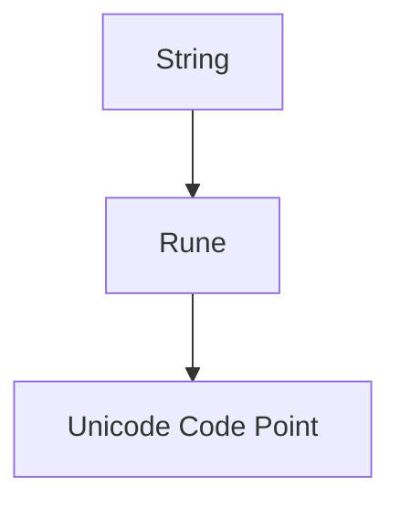

# ST.3 Unicode and Runes

## Mission

- Differentiate between bytes, runes, and UTF-8 encoding.
- Understand why `len()` is misleading for multi-byte text.
- Utilize the `unicode` and `unicode/utf8` packages for character processing.
- Iterate safely over multi-byte strings using the `for range` loop.

## Prerequisites

- `ST.2` Formatting

## Mental Model

Go strings are immutable byte slices (`[]byte`) that are expected to contain UTF-8 encoded text. While ASCII characters occupy a single byte, many Unicode characters (including accented letters, CJK characters, and emojis) require between 2 and 4 bytes. In Go, a **rune** is an alias for `int32` and represents a single Unicode code point. To process text correctly at the character level, developers must work with runes rather than raw bytes.

## Visual Model



## Machine View

The UTF-8 encoding is a variable-width character encoding. When Go encounters a `for range` loop on a string, the runtime decodes the bytes on the fly, yielding one rune at a time. However, the index provided in the loop is the **byte offset**, not the character index. For example, if a 3-byte character starts at offset 0, the next character will be at offset 3. Slicing a string (e.g., `s[0:2]`) performs a byte-level slice, which can result in "malformed" text if it cuts in the middle of a multi-byte sequence.

## Run Instructions

```bash
go run ./04-types-design/21-unicode
```

## Code Walkthrough

### Counting Characters

Use `utf8.RuneCountInString` to get the actual number of Unicode characters.

```go
s := "café"
len(s)                 // 5 (bytes)
utf8.RuneCountInString(s) // 4 (runes)
```

### Safe Iteration

The `for range` loop is the standard way to iterate over runes in a string.

```go
for i, r := range s {
    fmt.Printf("Byte index: %d, Rune: %c\n", i, r)
}
```

### Classification

The `unicode` package provides character classification functions based on the Unicode standard.

```go
unicode.IsLetter('A') // true
unicode.IsDigit('9')  // true
unicode.IsSpace('\n') // true
```

## Try It

### Automated Tests

```bash
go test ./...
```

### Manual Verification

- Iterate over a string containing both ASCII and Emojis using both a standard `for i` loop and a `for range` loop.
- Observe how the standard `for i` loop fails to print the multi-byte characters correctly.
- Verify character classifications for a diverse set of Unicode code points.

## In Production

- **Input Validation**: Ensuring usernames or passwords meet specific character requirements (e.g., allowing Unicode letters).
- **Text Normalization**: Stripping accents or specialized symbols from international user input.
- **Data Sanitization**: Removing control characters or non-printable symbols from incoming data streams.

## Thinking Questions

1. Why does Go use UTF-8 as its default encoding for source code and strings?
2. What are the performance implications of `utf8.RuneCountInString` compared to `len()`?
3. How would you reverse a string that contains multi-byte characters?

## Next Step

Next: `ST.4` -> [`04-types-design/22-regex`](../22-regex/README.md)
