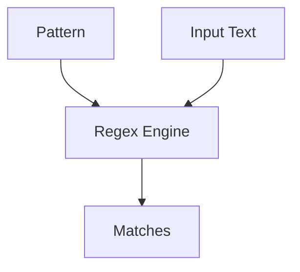

# ST.4 Regular Expressions

## Mission

- Compile regular expressions using `Compile` and `MustCompile`.
- Apply pattern matching, extraction, and replacement operations.
- Utilize capture groups and named sub-expressions for data parsing.
- Understand the performance characteristics of Go's RE2 engine.

## Prerequisites

- `ST.3` Unicode

## Mental Model

A **Regular Expression** (regex) is a sequence of characters that defines a search pattern. In Go, the `regexp` package provides support for these patterns using the RE2 syntax. Unlike many other languages that use backtracking-based engines (which can suffer from exponential execution time), Go's RE2 engine uses a deterministic finite automaton (DFA) approach. This ensures that matching time is linear relative to the input size, preventing "catastrophic backtracking" security vulnerabilities.

## Visual Model



## Machine View

When you call `regexp.Compile`, Go builds a state machine representing your pattern. This process is computationally expensive, so it should be done once (typically at program startup) rather than inside a loop. `MustCompile` is a helper that panics if the regex is invalid, which is appropriate for hardcoded patterns where an invalid regex represents a developer error rather than a runtime condition.

## Run Instructions

```bash
go run ./04-types-design/22-regex
```

## Code Walkthrough

### Compilation

Prefer `MustCompile` for global variables or hardcoded patterns to ensure they are validated at initialization.

```go
var emailRegex = regexp.MustCompile(`^[a-z0-9._%+-]+@[a-z0-9.-]+\.[a-z]{2,}$`)
```

### Data Extraction

`FindStringSubmatch` returns a slice where the first element is the full match, and subsequent elements are the strings captured by parentheses `()`.

```go
match := logPattern.FindStringSubmatch(line)
if len(match) > 0 {
    date := match[1]
}
```

### Replacement

`ReplaceAllString` allows for pattern-based text transformation, such as redacting sensitive information.

```go
safeText := emailRegex.ReplaceAllString(rawText, "[REDACTED]")
```

## Try It

### Automated Tests

```bash
go test ./...
```

### Manual Verification

- Test the email regex against a variety of valid and invalid email formats.
- Parse a complex log entry with capture groups and verify that each field is correctly extracted.
- Perform a bulk replacement of patterns in a large block of text.

## In Production

- **Input Validation**: Verifying the format of emails, phone numbers, or specialized IDs.
- **Log Parsing**: Extracting structured fields from unstructured text logs for ingestion into monitoring systems.
- **Data Sanitization**: Stripping potentially dangerous characters or redacting PII (Personally Identifiable Information).

## Thinking Questions

1. Why does Go's regex engine intentionally omit features like lookaheads and backreferences?
2. When should you use `regexp.Compile` instead of `regexp.MustCompile`?
3. How can you optimize regex performance when processing millions of lines of text?

## Next Step

Next: `ST.5` -> [`04-types-design/23-text-template`](../23-text-template/README.md)
