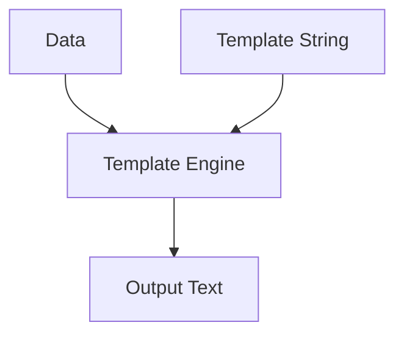

# ST.5 Text Templates

## Mission

- Define and parse text templates using `text/template`.
- Utilize dot notation (`.`), pipelines, and actions (`if`, `range`).
- Hydrate templates with exported struct fields and maps.
- Execute templates efficiently into `io.Writer` destinations.

## Prerequisites

- `ST.4` Regular Expressions

## Mental Model

Templates allow for the separation of data from its visual representation. In Go, the `text/template` package provides a data-driven mechanism for generating text output. Templates are strings containing "actions" wrapped in double curly braces `{{ }}`. These actions allow for variable substitution, conditional logic, and iteration. By decoupling the template from the logic, developers can change the output format without modifying the underlying application code.

## Visual Model



## Machine View

The template engine works in two primary phases:
1. **Parsing**: The raw template string is converted into an Abstract Syntax Tree (AST). This is a one-time cost that should happen during application initialization.
2. **Execution**: The engine walks the AST and uses the `reflect` package to pull values from the provided data object (struct or map) to fill the placeholders. The resulting text is streamed directly to an `io.Writer` (such as a file, network socket, or standard output), which is more memory-efficient than building a large string in memory first.

## Run Instructions

```bash
go run ./04-types-design/23-text-template
```

## Code Walkthrough

### Dot Notation (.)

The "dot" (`.`) within an action refers to the current data context. When executing a template on a struct, `.Field` accesses that exported field.

```go
tmpl.Execute(os.Stdout, data) // {{ .Name }} pulls from data.Name
```

### Iteration (range)

The `range` action iterates over a slice or map, setting the context (`.`) to the current element in each iteration.

```template
{{ range .Items }}
- {{ . }}
{{ end }}
```

### Pipelines

Templates support pipelines, where the output of one command is passed as the input to the next, similar to Unix pipes.

```template
{{ .Name | printf "%q" }}
```

## Try It

### Automated Tests

```bash
go test ./...
```

### Manual Verification

- Modify the `EmailData` struct and the template to include a new field (e.g., `Timestamp`) and verify it renders correctly.
- Test the `if` condition by changing `UnreadCount` to `0` and ensuring the alternative message is displayed.
- Verify that using an unexported field in the struct causes the template execution to fail or render nothing for that field.

## In Production

- **Email Generation**: Building dynamic HTML or text emails with personalized content.
- **Config Generation**: Automatically generating configuration files (Nginx, Prometheus) based on environment metadata.
- **Code Generation**: Building boilerplate code or API clients from schema definitions (like OpenAPI).

## Thinking Questions

1. Why must struct fields be exported for use in templates?
2. What is the difference between `text/template` and `html/template`? (Hint: think about security/escaping).
3. How can you provide custom functions to your templates using `Funcs`?

## Next Step

Next: `ST.6` -> [`04-types-design/24-config-parser-project`](../24-config-parser-project/README.md)
