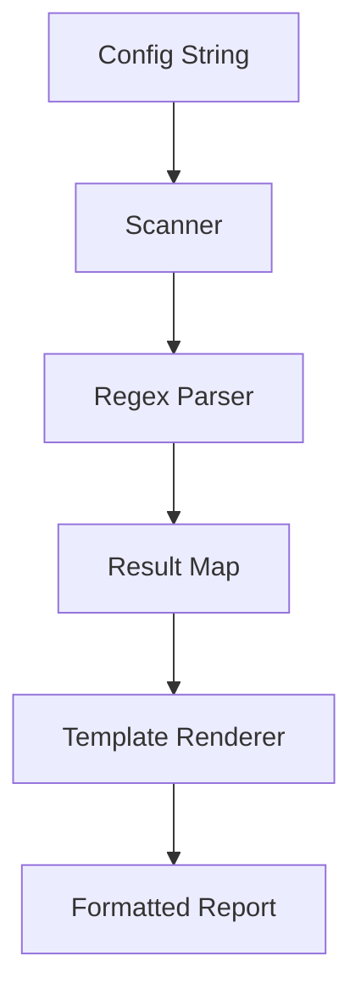

# ST.6 Case Study: Config Parser

## Mission

- Build a robust text-processing pipeline for configuration parsing.
- Combine `bufio.Scanner`, `regexp`, and `strings` for data extraction.
- Implement stable summary generation using `text/template` and sorting.
- Handle edge cases like comments, whitespace, and quoted values.

## Prerequisites

- `ST.5` Text Templates

## Mental Model

Many Go applications rely on `.env` or simple `KEY=VALUE` configuration files. Parsing these files requires a coordinated pipeline: reading raw lines, filtering noise (comments and empty lines), validating syntax with regular expressions, and storing the results in a structured format (a map). This case study demonstrates how to combine the various text-processing tools learned in this section into a cohesive, production-ready utility.

## Visual Model



## Machine View

The pipeline operates in two distinct stages:
1. **Ingestion**: Using `bufio.Scanner` to read the input line-by-line without loading the entire file into memory at once.
2. **Extraction**: Using a single, pre-compiled regular expression to decompose each valid line into a key and a value. The regex handles multiple quoting styles (single, double, or none) and ignores trailing comments.
3. **Consolidation**: Storing results in a `map[string]string`.
4. **Stable Output**: Converting the map back into a sorted slice of structs and rendering it via `text/template`. Sorting is crucial because Go maps iterate in random order; without sorting, the output would be non-deterministic.

## Run Instructions

```bash
go run ./04-types-design/24-config-parser-project
```

## Solution Walkthrough

### The Regex Engine

A complex regex is used to handle optional quotes and trailing comments.

```go
re := regexp.MustCompile(`^\s*([\w.-]+)\s*=\s*(?:'([^']*)'|"([^"]*)"|([^#\s]*))?(?:\s*#.*)?$`)
```

### Map to Sorted Slice

To ensure the rendered output is always in the same order, we move data from a map to a slice and sort it by key.

```go
sort.Slice(entries, func(i, j int) bool {
    return entries[i].Key < entries[j].Key
})
```

### Template Rendering

The final summary is generated using a template that iterates over the sorted entries.

```template
{{range . -}}
- {{.Key}}={{printf "%q" .Value}}
{{end}}
```

## Try It

### Automated Tests

```bash
go test ./...
```

## Verification Surface

- Add a malformed line (e.g., `KEY WITHOUT EQUALS`) and verify the parser returns a descriptive error.
- Add a new configuration key with a complex value (e.g., a URL with special characters) and verify it is correctly parsed and rendered.

## In Production

- **Environment Loaders**: Loading `.env` files into system environment variables.
- **Log Scrapers**: Parsing unstructured log files into structured JSON for analysis.
- **Data Ingestion**: Converting CSV or fixed-width text files into database records.

## Thinking Questions

1. Why is `bufio.Scanner` preferred over `strings.Split(content, "\n")` for large inputs?
2. What are the security implications of using a custom regex to parse potentially untrusted configuration files?
3. How would you modify the parser to support multi-line values?

## Next Step

Next: `MP.1` -> [`05-packages-io/01-modules-and-packages/1-module-basics`](../../05-packages-io/01-modules-and-packages/1-module-basics/README.md)
