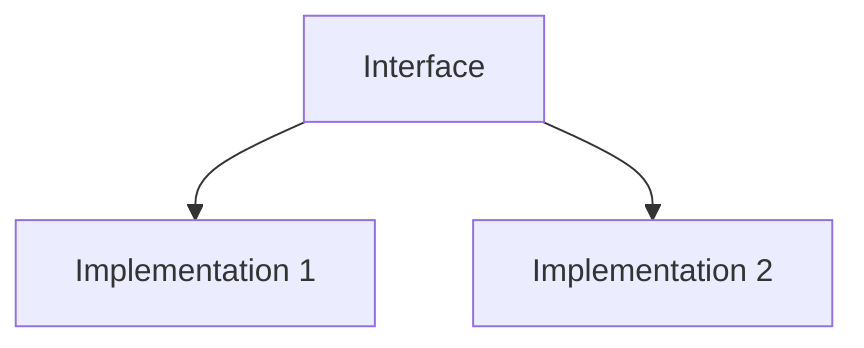

# TI.3 Interfaces

## Mission

- Define behavioral contracts using the `interface` keyword.
- Implement implicit interface satisfaction (structural typing).
- Achieve polymorphism through interface abstraction.

## Prerequisites

- `TI.2` Methods

## Mental Model

An **Interface** is a type that defines a set of method signatures. Unlike concrete types (structs), an interface does not contain data or implementation logic. Instead, it specifies **what** a type must be able to do, rather than **how** it is structured. This enables decoupled system design where functions can operate on any type that satisfies a given behavioral contract.

## Visual Model



## Machine View

An interface variable is internally represented as a **Two-Word Data Structure**:

1.  **ITab Pointer**: Points to an "Interface Table" containing the concrete type's runtime information and the function pointers for its methods.
2.  **Data Pointer**: Points to the concrete instance (the struct) in memory.

When a method is called on an interface variable, Go performs **Dynamic Dispatch**: it looks up the correct function pointer in the ITab and executes it using the data pointer as the receiver.

## Run Instructions

```bash
go run ./04-types-design/3-interfaces
```

## Code Walkthrough

- **Implicit Satisfaction**: Go has no `implements` keyword. A type satisfies an interface automatically if it possesses all the required methods. This is often referred to as **Structural Typing**.
- **The Empty Interface (`any`)**: An interface with no methods is satisfied by every type.
- **Composition**: Small, single-method interfaces (like `io.Reader`) are the building blocks of Go APIs.
- **Accept Interfaces, Return Structs**: A common Go design pattern that maximizes flexibility for callers while keeping return types explicit.

## Try It

1. In `main.go`, add a new struct type `Square` with a `Side` field.
2. Implement the `Area()` and `Perimeter()` methods for `Square`.
3. Verify that the `printShapeInfo` function accepts a `Square` instance without modification.

## In Production

- **Dependency Injection**: Passing mock database interfaces into services for unit testing.
- **Pluggable Architecture**: Allowing users of a library to provide custom implementations of standard behaviors (e.g., custom HTTP handlers).
- **Generic Data Handling**: Processing various data types through common interfaces like `fmt.Stringer` or `error`.

## Thinking Questions

1. How does implicit interface satisfaction differ from the explicit "implements" contract in Java or C#?
2. What are the performance implications of the "2-word struct" and dynamic dispatch compared to direct method calls?
3. Why is it generally better to define small interfaces (1-3 methods) rather than large, comprehensive ones?

## Next Step

Next: `TI.4` -> [`04-types-design/4-interface-embedding`](../4-interface-embedding/README.md)
