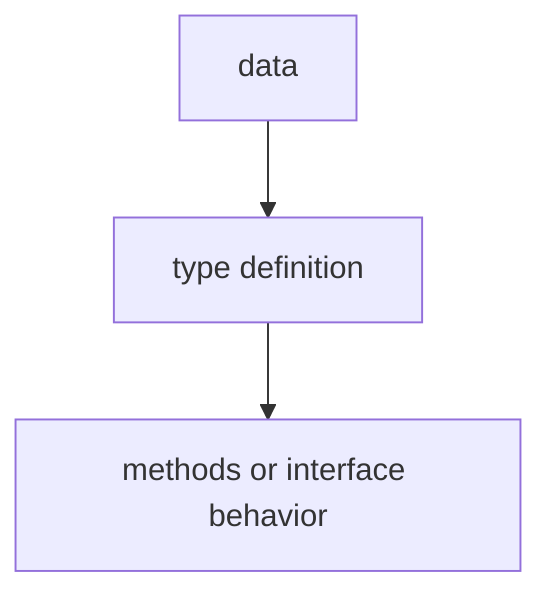

# TI.4 Interface Embedding

## Mission

Learn how to embed one interface into another to build larger contracts from smaller pieces.

## Why This Lesson Exists Now

You have learned that interfaces define contracts. Sometimes you want to combine multiple small contracts into one larger contract. Interface embedding lets you do this without copying method signatures.

> **Backward Reference:** In [Lesson 3: Interfaces](../3-interfaces/README.md), you learned the basics of behavior contracts. Now, we will see how to compose those contracts to create more sophisticated and reusable abstractions.

## Prerequisites

- `TI.3` interfaces

## Mental Model

Think of a universal remote. It does not have buttons for every function directly-it embeds the capabilities of a TV remote, a DVD remote, and a sound system remote into one. The universal remote "has-a" TV control, "has-a" DVD control, etc.

## Visual Model


```text
// Embedded interfaces combine contracts
type Reader interface {
    Read(p []byte) (n int, err error)
}

type Writer interface {
    Write(p []byte) (n int, err error)
}

// ReadWriter embeds both Reader and Writer
type ReadWriter interface {
    Reader  // embedded
    Writer  // embedded
}
```

## Machine View

When interface A embeds interface B, the resulting interface has all methods from both. The embedding is static-the compiler checks at compile time that the embedded contracts are satisfied.

## Run Instructions

```bash
go run ./04-types-design/4-interface-embedding
```

## Code Walkthrough

### Embedding individual interfaces

When you embed interfaces, you get all their methods. No need to list them explicitly.

### Embedding multiple interfaces

One interface can embed multiple interfaces, combining their contracts.

### Use case: io.ReadWriter

The standard library's io.ReadWriter is a classic example-embedding io.Reader and io.Writer.

## Try It

1. Create an interface that embeds io.Reader and add one more method of your own.
2. Implement your combined interface with a struct.
3. Verify that satisfying the embedded interfaces automatically satisfies the combined one.

## In Production
Interface embedding is used throughout the standard library (io.ReadWriter, io.ReadCloser, etc.) and in real APIs to compose behavior contracts.

## Thinking Questions
1. What problem is this lesson trying to solve?
2. What would change if you removed this idea from the program?
3. Where do you expect to see this pattern again in real Go code?

> **Forward Reference:** One of the most common interfaces in Go is `fmt.Stringer`. In [Lesson 5: Stringer](../5-stringer/README.md), you will learn how to implement this interface to control how your types are represented as text.

## Next Step

Continue to `TI.5` Stringer.
