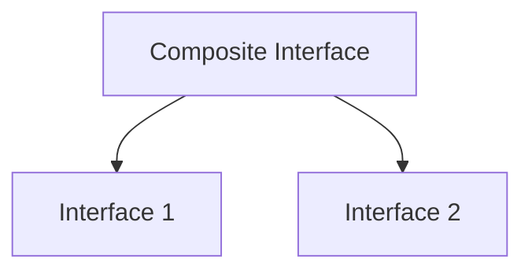

# TI.4 Interface Embedding

## Mission

- Compose complex behavioral contracts from simpler, atomic interfaces.
- Eliminate method signature duplication through embedding.
- Understand the Interface Segregation Principle in the context of Go.

## Prerequisites

- `TI.3` Interfaces

## Mental Model

**Interface Embedding** allows one interface to include the method set of another. This is the primary mechanism for behavioral composition in Go. Instead of defining large, monolithic interfaces, Go developers create small, focused interfaces and combine them as needed to build more specific requirements.

## Visual Model



## Machine View

Interface embedding is a **Compile-Time Operation**. When an interface is embedded into another, the Go compiler performs **Method Set Aggregation**:

- The resulting interface's method set is the union of all embedded method sets plus any locally defined methods.
- There is no runtime delegation or performance penalty; calling a method on an embedded interface is identical to calling it on an interface where the method was explicitly listed.
- The compiler enforces method signature consistency; if two embedded interfaces define the same method with different signatures, a compile-time error occurs.

## Run Instructions

```bash
go run ./04-types-design/4-interface-embedding
```

## Code Walkthrough

- **Composition over Inheritance**: Embedding provides a way to reuse behavioral definitions without the rigid hierarchy of traditional object-oriented inheritance.
- **Granularity**: Maintaining small interfaces (often 1-2 methods) ensures that types only need to implement the specific logic required for a given operation.
- **Standard Library Patterns**: The `io` package extensively uses embedding (e.g., `io.ReadCloser` embeds `io.Reader` and `io.Closer`).

## Try It

1. In `main.go`, define a new interface `ReadWriteCloser` that embeds the existing `ReadWriter` and adds a `Close() error` method.
2. Add a `Close()` method to the `Buffer` struct to satisfy the new interface.
3. Verify that the compiler allows the `Buffer` instance to be used where a `ReadWriteCloser` is expected.

## In Production

- **Service Definitions**: Composing a `Storage` interface from `Reader` and `Writer` components.
- **Middleware Integration**: Building a `Context` interface that embeds standard `context.Context` plus custom logging or tracing methods.
- **Resource Management**: Using `ReadCloser` or `WriteCloser` to ensure that I/O operations are followed by proper resource disposal.

## Thinking Questions

1. Why is interface embedding considered more flexible than class-based inheritance?
2. What happens if two embedded interfaces both define an identical method signature? Is this an error?
3. How does interface embedding support the "Interface Segregation Principle"?

## Next Step

Next: `TI.6` -> [`04-types-design/6-type-switch`](../6-type-switch/README.md)
