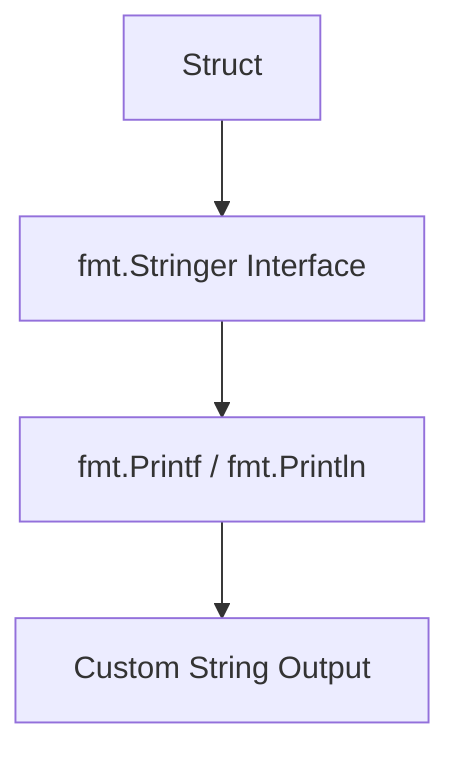

# TI.5 Stringer

## Mission

- Implement the `fmt.Stringer` interface for custom types.
- Control the textual representation of data in logs and output.
- Define new types based on primitive types and attach methods to them.

## Prerequisites

- `TI.2` Methods
- `TI.3` Interfaces

## Mental Model

The **Stringer** interface, defined in the `fmt` package, is the standard way to provide a human-readable representation of a type. It consists of a single method: `String() string`. When a type implements this method, many standard library functions (like `fmt.Println`, `log.Printf`, and `fmt.Errorf`) will automatically use it to format the output.

## Visual Model



## Machine View

The `fmt` package uses **Interface Detection** at runtime. When you pass a value to `fmt.Println(v)`:

1.  `fmt` checks if `v` satisfies the `Stringer` interface.
2.  Internally, this involves inspecting the value's **ITab** to see if a `String()` method exists.
3.  If found, the method is executed, and its return value is printed.
4.  If not found, `fmt` falls back to a default representation based on the value's fields and type.

## Run Instructions

```bash
go run ./04-types-design/5-stringer
```

## Code Walkthrough

- **Type Definitions**: `type MyInt int` creates a new type that inherits the underlying structure of `int` but allows you to attach unique methods (like `String()`) to it.
- **Self-Documentation**: Implementing `Stringer` is essential for debugging. Instead of seeing a raw integer `3`, you can see a meaningful label like `Wednesday`.
- **Enumerations**: Combining `iota` with custom types and the `Stringer` interface creates powerful, readable enums in Go.

## Try It

1. In `main.go`, add a new constant `Unknown` to the `Weekday` type and update the `String()` method to handle it.
2. Create a new struct `Product` with `Name` and `Price` fields. Implement the `Stringer` interface to return a formatted string like `Product: Laptop ($999.99)`.
3. Print the `Product` using `fmt.Println` and verify the output.

## In Production

- **Logging**: Ensuring that complex state objects are summarized clearly in application logs.
- **API Models**: Providing a default string representation for domain objects like `User` or `Account`.
- **Command Line Tools**: Controlling how flags and arguments are displayed to the user.

## Thinking Questions

1. Why is it better to implement `Stringer` rather than creating a custom method like `Display()`?
2. How does defining a custom type on top of an `int` provide more type safety than using raw integers?
3. What happens if your `String()` method calls another function that also calls `String()` on the same object? (Hint: recursion).

## Next Step

Next: `TI.6` -> [`04-types-design/6-type-switch`](../6-type-switch/README.md)
