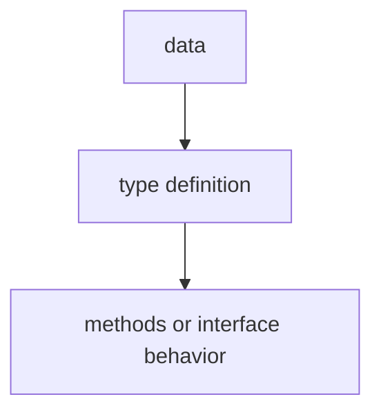

# TI.5 Stringer

## Mission

Learn how to control how your types are displayed by implementing the `fmt.Stringer` interface.

## Why This Lesson Exists Now

You have learned how to define structs and methods. The next practical question is: "How do I control what shows when I print my type?"

When you pass a struct to `fmt.Println`, Go prints the raw fields by default. To control the output, implement the `fmt.Stringer` interface.

## Prerequisites

- `TI.2` methods
- `TI.3` interfaces

## Mental Model

Think of a business card. The card shows a carefully formatted summary - not raw data. The `String()` method is your type's business card. Without it, Go prints the raw struct fields. With it, you control exactly how your type is presented.

## Visual Model



```text
fmt.Stringer interface
  - String() string

Examples
  - HTTPStatus -> String()
  - Weekday -> String()
```

## Machine View

The `fmt` package automatically checks for the `Stringer` interface when printing. If your type implements `String() string`, `fmt.Println`, `fmt.Printf` with `%s` or `%v`, `log.Println`, and error messages will all call your method.

## Run Instructions

```bash
go run ./04-types-design/5-stringer
```

## Code Walkthrough

### `func (s HTTPStatus) String() string {`

This implements `fmt.Stringer` for `HTTPStatus`. Now when you print an `HTTPStatus`, it shows `HTTP 200: OK` instead of the raw struct.

### Custom types

You can create new types from existing ones: `type Weekday int`. This creates a completely new type - `Weekday` and `int` are not interchangeable.

### Stringer with iota

Combine custom types with `iota` (from Section 02) to create enum-like constants.

## Try It

1. Add a `String()` method to the `Server` struct from TI.1 and test it with `fmt.Println`.
2. Create a custom type based on `float64` and implement `Stringer`.
3. Try printing a value before and after adding the `Stringer` implementation.

## Common Questions

- Why is Stringer the most commonly implemented interface?
  Because every type needs to be displayed somewhere - logs, errors, and user output.

- What is the difference between `%v` and `%s`?
  `%v` uses `String()` if available, while `%s` specifically expects string output.

## In Production

Stringer is essential for logging, debugging, and user-facing output. It makes your types readable in any context where they are printed or logged.

## Thinking Questions

1. What problem is this lesson trying to solve?
2. What would change if you removed this idea from the program?
3. Where do you expect to see this pattern again in real Go code?

## Next Step

Continue to `TI.6` type switch.
