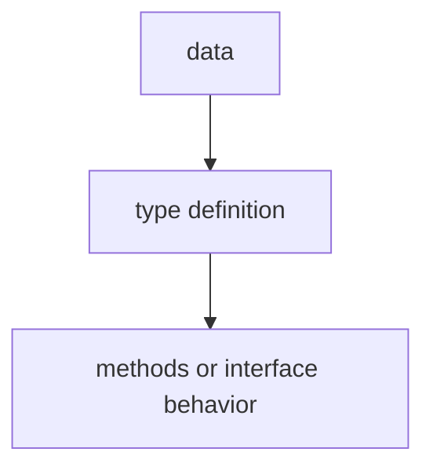

# TI.6 Type Switch

## Mission

Learn how to use type switches to handle different concrete types stored in an interface.

## Why This Lesson Exists Now

You have learned about type assertions (checking one type). Sometimes you need to check against multiple possible types. Type switches let you handle many types in one clean syntax.

> **Backward Reference:** In [Lesson 5: Stringer](../5-stringer/README.md), you learned how to implement a specific, standard interface. Now we will learn how to "look inside" an interface value to see what concrete type it actually holds.

## Prerequisites

- `TI.3` interfaces

## Mental Model

Think of a sorting machine. Items come down the belt, and different items need different handling-fragile items go to one bin, heavy items to another, documents to a third. The machine "switches" on the type of item to decide where it goes.

## Visual Model


```text
switch v := value.(type) {
case string:
    // v is string
case int:
    // v is int
case *MyStruct:
    // v is pointer to MyStruct
default:
    // unknown type
}
```

## Machine View

A type switch is like a regular switch, but instead of comparing values, it compares types. The `value.(type)` syntax extracts the concrete type from the interface.

## Run Instructions

```bash
go run ./04-types-design/6-type-switch
```

## Code Walkthrough

### Basic type switch

Use `value.(type)` inside a switch to get the concrete type.

### Multiple type handling

Different cases can handle different types, with different logic for each.

### Default case

The default case handles types you have not explicitly handled.

## Try It

1. Add a new type to the shape example and handle it in the type switch.
2. Use a type switch inside a function that accepts interface{}.
3. Try calling a method that only exists on one specific type using type switch.

## Common Questions

- What is the difference between type assertion and type switch?
  Type assertion checks one type. Type switch checks multiple types in one statement.

- When should I use type switches?
  When you have an interface that can hold multiple concrete types and you need different logic for each.

## In Production
Type switches are used in serialization (json.Unmarshal), reflection, and handling API responses that return different types.

## Thinking Questions
1. What problem is this lesson trying to solve?
2. What would change if you removed this idea from the program?
3. Where do you expect to see this pattern again in real Go code?

> **Forward Reference:** Now that you know how to work with interfaces, it is time to understand a subtle but critical rule about how Go decides if a type satisfies an interface based on its methods. In [Lesson 7: Receiver Sets](../7-receiver-sets/README.md), we will dive into the "method set" rules.

## Next Step

Next: `TI.7` -> `04-types-design/7-receiver-sets`

Open `04-types-design/7-receiver-sets/README.md` to continue.
