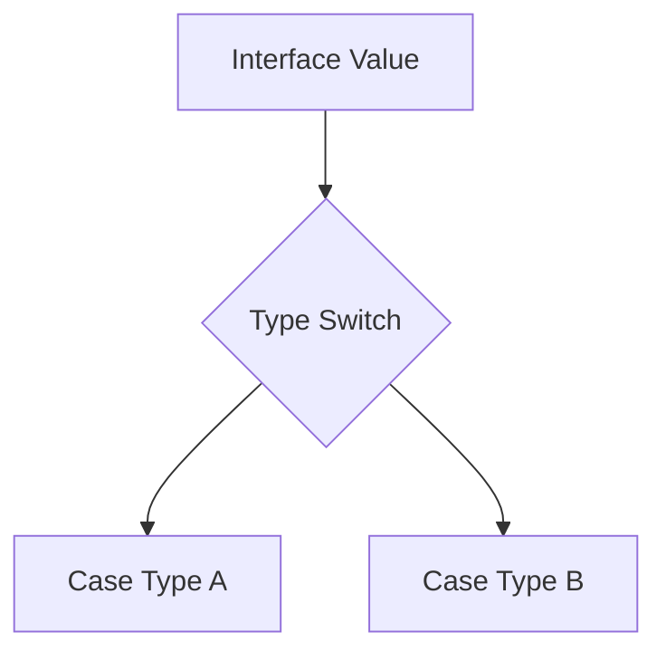

# TI.6 Type Switch

## Mission

- Utilize type switches to branch program logic based on concrete types.
- Extract concrete values from interface variables using the `value.(type)` syntax.
- Implement comprehensive type handling including multiple cases and default branches.

## Prerequisites

- `TI.3` Interfaces

## Mental Model

While interfaces abstract behavior, there are scenarios where a program must differentiate between concrete implementations to perform type-specific operations. A **Type Switch** is a control structure that allows for this runtime inspection in a safe and readable manner. It compares the dynamic type of an interface value against multiple specific type cases.

## Visual Model



## Machine View

Internally, a type switch leverages the **ITab** (Interface Table) of an interface value. When `value.(type)` is called:

1.  Go accesses the type descriptor pointer within the interface's internal 2-word structure.
2.  The runtime compares this descriptor against the type descriptors listed in each `case`.
3.  If a match is found, the variable in the assignment (`v := value.(type)`) is redeclared as the concrete type for that specific case block, allowing for direct field and method access without further casting.

## Run Instructions

```bash
go run ./04-types-design/6-type-switch
```

## Code Walkthrough

- **Syntax**: `switch v := i.(type) { ... }`. The variable `v` takes on the concrete type and value of `i` within each case.
- **Fallthrough**: Unlike value switches, type switches do **not** support the `fallthrough` keyword.
- **Multiple Types**: A single case can handle multiple types (e.g., `case int, int64:`), in which case the variable `v` remains the interface type because it cannot be narrowed to a single concrete type.
- **Default Case**: Always recommended to handle unexpected types and maintain system robustness.

## Try It

1. In `main.go`, add a new struct type `Square` and include it in the `shapes` slice.
2. Update the `describeShape` and `getArea` functions to handle the `Square` type within their respective type switches.
3. Verify that the output correctly reflects the new type.

## In Production

- **Serialization/Deserialization**: Handling diverse data types during JSON or binary encoding.
- **Generic Handling**: Processing data from an `any` (empty interface) source where the incoming shape is not guaranteed.
- **Error Handling**: Discriminating between different custom error types to apply specific recovery logic.

## Thinking Questions

1. Why does Go use a specific switch syntax for types instead of allowing standard equality checks (e.g., `if typeOf(i) == Circle`)?
2. What are the safety benefits of using a type switch over multiple individual type assertions?
3. In what situations would you consider a type switch a "code smell," and how could you refactor it using interface methods?

## Next Step

Next: `TI.11` -> [`04-types-design/11-dynamic-typing-with-any`](../11-dynamic-typing-with-any/README.md)
