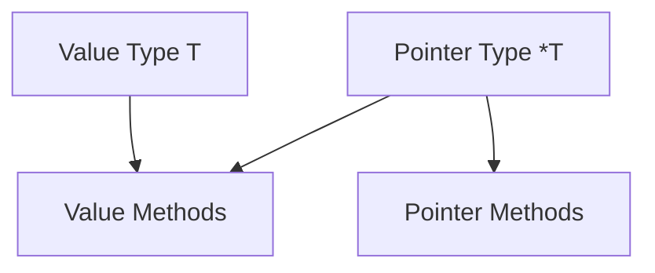

# TI.7 Receiver Sets

## Mission

- Define the **Method Set** of a type.
- Understand how receiver choice (value vs. pointer) affects interface implementation.
- Analyze the technical reasons why pointer types "inherit" value-receiver methods.

## Prerequisites

- `TI.2` Methods

## Mental Model

A **Method Set** is the collection of methods associated with a type. The Go compiler uses these sets to determine if a concrete type satisfies a specific interface contract. The set of methods available to a type depends on whether the type is a value (`T`) or a pointer (`*T`).

## Visual Model



## Machine View

At compile-time, Go performs a strict check when a concrete type is assigned to an interface.

- **Method Set of `T`**: Includes only methods defined with a value receiver `(t T)`.
- **Method Set of `*T`**: Includes methods defined with a pointer receiver `(t *T)` **and** methods defined with a value receiver `(t T)`.

This asymmetry exists because a pointer can always be dereferenced to access the underlying value, but a value may not always be addressable (e.g., if it's a temporary result of an expression). To ensure safety, Go only allows pointer-receiver methods to be called on types that have a guaranteed memory address.

## Run Instructions

```bash
go run ./04-types-design/7-receiver-sets
```

## Code Walkthrough

- **Value-Receiver Methods**: Visible to both values and pointers.
- **Pointer-Receiver Methods**: Visible ONLY to pointers.
- **Interface Compatibility**: If an interface requires a method that uses a pointer receiver, you MUST pass a pointer (e.g., `&MyStruct{}`) to the interface variable. Passing the value will result in a compiler error.

| Receiver Type | Method Set contains... |
| --- | --- |
| `T` (Value) | Methods with receiver `(t T)` |
| `*T` (Pointer) | Methods with receiver `(t T)` **and** `(t *T)` |

## Try It

1. In `main.go`, attempt to assign a `Counter` value (not a pointer) to an interface variable that requires the `Inc()` method.
2. Review the resulting compiler error: `Counter does not implement Writer (Inc method has pointer receiver)`.
3. Fix the assignment by using the address-of operator (`&`).

## In Production

- **Interface Implementation**: Ensuring a struct correctly satisfies large interfaces like `sql.Scanner` or `json.Unmarshaler`.
- **API Design**: Deciding whether to expose values or pointers based on the required behavioral capabilities.
- **Mocking**: Designing mock objects that correctly replicate the method sets of production types.

## Thinking Questions

1. Why does Go prevent a value from "inheriting" pointer methods?
2. How does this rule protect against unintended state mutation on temporary values?
3. In a production system, would you prefer designing interfaces around value-receiver methods or pointer-receiver methods? Why?

## Next Step

Next: `TI.3` -> [`04-types-design/3-interfaces`](../3-interfaces/README.md)
