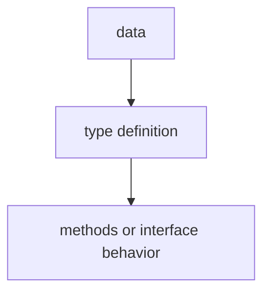

# TI.7 Receiver Sets

## Mission

Learn the difference between value and pointer receivers and understand how method sets determine interface satisfaction.

## Why This Lesson Exists Now

After learning methods in TI.2, you need to understand how receiver choice affects what methods your type actually provides. This matters when your type needs to satisfy an interface.

> **Backward Reference:** In [Lesson 6: Type Switch](../6-type-switch/README.md), you learned how to inspect concrete types inside an interface. Now, we will look at the rules that determine which types are even allowed into an interface in the first place based on their "Method Set."

## Prerequisites

- `TI.2` methods
- `TI.3` interfaces

## Mental Model

Think of a type's method set like a menu. A Counter value has only the Get() menu item. A *Counter pointer has the full menu: Get(), Inc(), Reset(). The pointer version inherits the value receiver methods but adds its own.

## Visual Model



| Method      | `Counter` (value type) | `*Counter` (pointer type) |
| ----------- | ---------------------- | ------------------------- |
| `Get() int` | [x] (value receiver)   | [x] (inherited)           |
| `Inc()`     | [ ] (pointer receiver) | [x] (pointer receiver)    |
| `Reset()`   | [ ] (pointer receiver) | [x] (pointer receiver)    |

## Machine View

At runtime, Go checks the method set when assigning to an interface. A value type only satisfies interfaces if all required methods are in its method set those from value receivers plus any pointer receivers if the address is taken.

## Run Instructions

```bash
go run ./04-types-design/7-receiver-sets
```

## Code Walkthrough

### Counter struct

A simple struct with an integer field.

### Value receiver methods

Get() uses a value receiver-it works on both Counter and \*Counter.

### Pointer receiver methods

Inc() and Reset() use pointer receivers-they only work on \*Counter.

### Interface satisfaction

The Reader interface requires Get(). Counter value satisfies it because Get() has a value receiver. \*Counter also satisfies it because pointer types inherit value receiver methods.

## Try It

1. Try assigning a Counter value to a variable that needs Inc()-it fails because the value doesn't have that method.
2. Pass &Counter to the same variable-it works because the pointer has Inc().
3. Add a new method with a pointer receiver and see if the interface still accepts the value type.

## In Production
Method sets affect API design. If you export a type that only has pointer receiver methods, callers must pass pointers. If you mix receiver types, document which interface they satisfy.

## Thinking Questions
1. What problem is this lesson trying to solve?
2. What would change if you removed this idea from the program?
3. Where do you expect to see this pattern again in real Go code?

> **Forward Reference:** One of the most powerful uses of custom types and method sets is creating domain-specific error types. In [Lesson 8: Custom Errors](../8-custom-errors/README.md), you will learn how to implement the standard `error` interface with your own structs to carry rich diagnostic data.

## Next Step

Next: `TI.8` -> `04-types-design/8-custom-errors`

Open `04-types-design/8-custom-errors/README.md` to continue.
