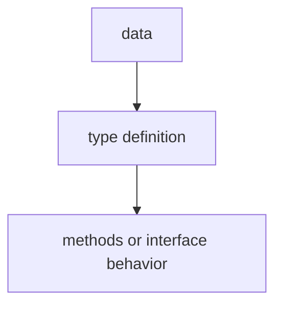

# TI.8 Custom Error Types

## Mission

Learn how to define custom error types that carry structured information for better error handling.

## Why This Lesson Exists Now

Go's built-in error interface is simple: just `Error() string`. But sometimes you need more information-what went wrong, where, and additional context. Custom error types let you do this.

> **Backward Reference:** In [Lesson 7: Receiver Sets](../7-receiver-sets/README.md), you learned how receiver types affect interface satisfaction. Now, we will apply that knowledge to implement the built-in `error` interface using our own custom structs.

## Prerequisites

- `TI.3` interfaces
- `TI.5` Stringer

## Mental Model

Think of a boarding pass. A simple "flight delayed" message is not enough. A good error includes: flight number, original time, new time, reason, and gate. Custom errors are like detailed boarding passes for your program.

## Visual Model


```text
type ValidationError struct {
    Field   string
    Value   interface{}
    Message string
}

func (e ValidationError) Error() string {
    return fmt.Sprintf("%s: %v - %s", e.Field, e.Value, e.Message)
}
```

## Machine View

Custom errors implement the error interface by providing an Error() method. You can add any fields and use errors.As() to check specific error types.

## Run Instructions

```bash
go run ./04-types-design/8-custom-errors
```

## Code Walkthrough

### Basic custom error

Define a struct and implement the Error() method.

### Error with fields

Add fields to carry structured information.

### Type assertions for errors

Use errors.As() to check specific error types and handle them differently.

## Try It

1. Create a custom error type with multiple fields.
2. Use errors.As() to check for your custom error and access its fields.
3. Wrap multiple error types and handle each differently.

## In Production
Custom errors are used in real applications for validation errors, API errors with codes, and database errors with retry information.

## Thinking Questions
1. What problem is this lesson trying to solve?
2. What would change if you removed this idea from the program?
3. Where do you expect to see this pattern again in real Go code?

> **Forward Reference:** We have explored how to make types more specific. Now, we will look at how to make them more general. In [Lesson 9: Generics](../9-generics/README.md), you will learn how to write code that works with many different types while still maintaining type safety.

## Next Step

Continue to `TI.9` generics.