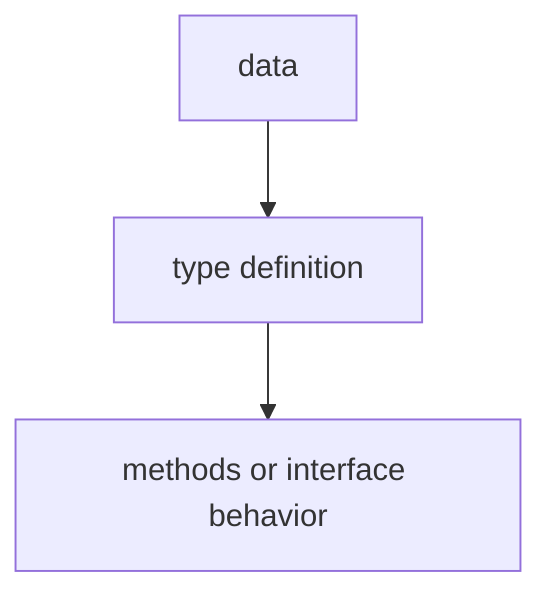

# TI.9 Generics

## Mission

Learn how to write functions and types that work with multiple types using type parameters and constraints.

## Why This Lesson Exists Now

You have interfaces for behavior abstraction. But sometimes you need to write utility functions that work with any type while maintaining type safety. Before generics, you had to write duplicate code or use interface{} and lose type safety.

> **Backward Reference:** In [Lesson 8: Custom Errors](../8-custom-errors/README.md), you learned how to make types more specific to your domain. Now, we will learn how to make functions and types more general, allowing them to handle many different types while remaining type-safe.

## Prerequisites

- `TI.3` interfaces
- `TI.5` Stringer

## Mental Model

Think of a vending machine. It does not care if it dispenses sodas, snacks, or toys-the mechanism is the same. The "type parameter" is what is in each slot. The "constraint" says "must fit in the slot."

## Visual Model


This diagram shows the generic function signature:

- `Sum` is the function name
- `[T Numeric]` declares a type parameter T constrained to numeric types
- `numbers []T` is the parameter (a slice of type T)
- `T` is the return type

## Machine View

When you call `Sum([]int{1, 2, 3})`, the compiler replaces T with int everywhere in the function. This is called monomorphization-the generic code is compiled into specific versions for each type used.

## Run Instructions

```bash
go run ./04-types-design/9-generics
```

## Code Walkthrough

### Type constraints

- `any`: accepts all types (equivalent to interface{})
- `comparable`: supports == and != operators
- Custom constraints: `type Numeric interface { int | float64 | ... }`

### Type parameters

The syntax `[T Numeric]` declares a type parameter T with constraint Numeric.

### Generic functions

- Sum: works with any numeric type
- Filter: works with any type
- Map: transforms from type T to type U

## Try It

1. Write a generic function that finds the maximum element in a slice.
2. Try using the wrong type with a constraint and observe the compiler error.
3. Write a generic function that works with two different types.

## Common Questions

- When to use generics vs interfaces?
  Use generics for data structures and algorithms that work with multiple types. Use interfaces for behavior abstraction and polymorphism.

- What is the performance impact?
  Generics are monomorphized at compile time-no runtime overhead.

## In Production
Generics are essential for building reusable data structures (maps, slices, trees) and utility functions without code duplication.

## Thinking Questions
1. What problem is this lesson trying to solve?
2. What would change if you removed this idea from the program?
3. Where do you expect to see this pattern again in real Go code?

> **Forward Reference:** We have now covered the core of Go's type system. It is time to put everything together-structs, methods, interfaces, and custom errors-in a realistic scenario. In [Lesson 10: Payroll Processor](../10-payroll-processor/README.md), you will build a system that handles multiple employee types and payment rules.

## Next Step

Continue to `TI.10` payroll-processor.
