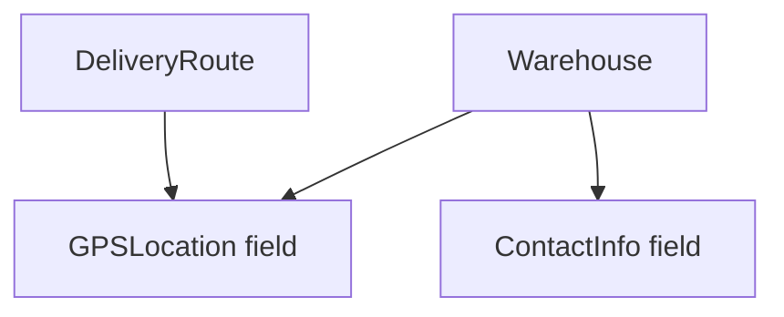

# CO.1 Composition

## Mission

Learn how Go builds larger types from smaller reusable parts through composition.

> **Backward Reference:** In [Lesson 15: Generic Data Structures](../../15-generic-data-structures/README.md), you learned how to create flexible containers for data. Now we look at the other side of system design: how to build complex, domain-specific types by combining smaller, focused components through Composition.

## Prerequisites

- `TI.1` structs
- `TI.2` methods

## Mental Model

Composition is a "has-a" relationship.

Instead of saying one type *is* another type, Go says a type can *contain* other types as fields. Each inner type keeps responsibility for its own behavior.

## Visual Model



## Machine View

A composed struct stores other structs as ordinary named fields. To use the inner behavior, code selects the field first and then calls the field's methods.

## Run Instructions

```bash
go run ./04-types-design/composition/1-composition
```

## Code Walkthrough

### `type GPSLocation struct { ... }`

This small component models reusable location data and owns its own formatting behavior.

### `type ContactInfo struct { ... }`

This is another focused component that holds communication details.

### `type Warehouse struct { ... }`

The warehouse is composed from reusable pieces with named fields like `Location` and `Contact`.

### `w.Location.String()` and `w.Contact.Summary()`

Named-field composition keeps ownership explicit at the call site.

### `type DeliveryRoute struct { ... }`

The same `GPSLocation` component gets reused in a completely different parent type.

## Try It

1. Add another field or method to `GPSLocation`.
2. Add a second route that reuses warehouse locations.
3. Rename one composed field and update the call sites.

## In Production
Composition is one of the main reasons Go code stays decoupled. Reusable components like config, metadata, stats, and identity blocks can be shared across many types without inheritance hierarchies.

## Thinking Questions
1. Why is named-field composition easier to reason about than inheritance trees?
2. What does explicit field access tell the reader?
3. Why is reusing the same component type across different parents powerful?

> **Forward Reference:** Named-field composition is explicit and clear. But sometimes, you want the parent to directly "inherit" the methods of the child for cleaner syntax. In [Lesson 2: Embedding](../2-embedding/README.md), you will learn how "anonymous" fields promote inner methods to the outer type.

## Next Step

Next: `CO.2` -> `04-types-design/composition/2-embedding`

Open `04-types-design/composition/2-embedding/README.md` to continue.
