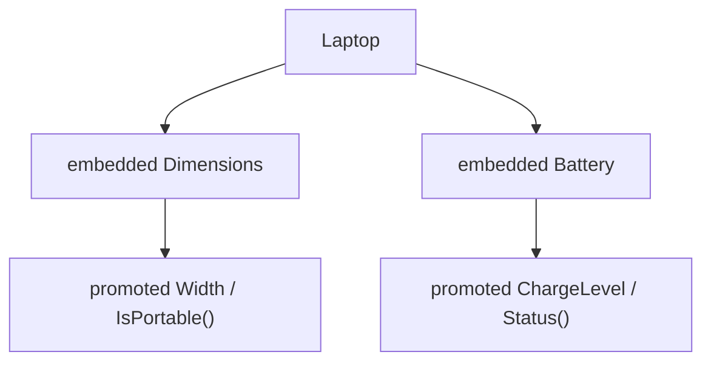

# CO.2 Embedding

## Mission

Learn how embedding promotes inner fields and methods to the outer type.

## Prerequisites

- `CO.1` composition

## Mental Model

Embedding is still composition, but with anonymous fields.

That means:

- the outer type still contains the inner type
- fields and methods from the inner type are promoted
- callers may use shortcut syntax on the outer type

## Visual Model



## Machine View

An embedded field is still a real field in the struct layout. Promotion is selector shorthand provided by the language. If the outer type defines a field or method with the same name, the outer definition shadows the embedded one.

## Run Instructions

```bash
go run ./04-types-design/composition/2-embedding
```

## Code Walkthrough

### `type Dimensions struct { ... }`

This reusable component provides size-related data and methods.

### `type Battery struct { ... }`

This component owns battery-specific behavior such as `IsLow` and `Status`.

### `type Laptop struct { Dimensions; Battery }`

These anonymous fields are what make the type embedding instead of named-field composition.

### Promoted access

`l.Width`, `l.IsPortable()`, and `l.Status()` all work directly on `Laptop` because the embedded members are promoted.

### `type Tablet struct { Battery; ChargeLevel string }`

This example demonstrates shadowing when the outer type defines a name that collides with an embedded field.

## Try It

1. Access an embedded field both explicitly and through promotion.
2. Add another method to `Battery` and call it through `Laptop`.
3. Create another shadowed field and inspect which one wins.

## ⚠️ In Production

Embedding is useful for wrappers, adapters, and reusable building blocks, but it is easy to overuse. Teams need to remember that promotion is convenience syntax, not inheritance magic.

## 🤔 Thinking Questions

1. What stays the same between composition and embedding?
2. What changes when promotion is available?
3. Why can shadowing be useful and dangerous at the same time?

## Next Step

Continue to `CO.3` bank account project.
