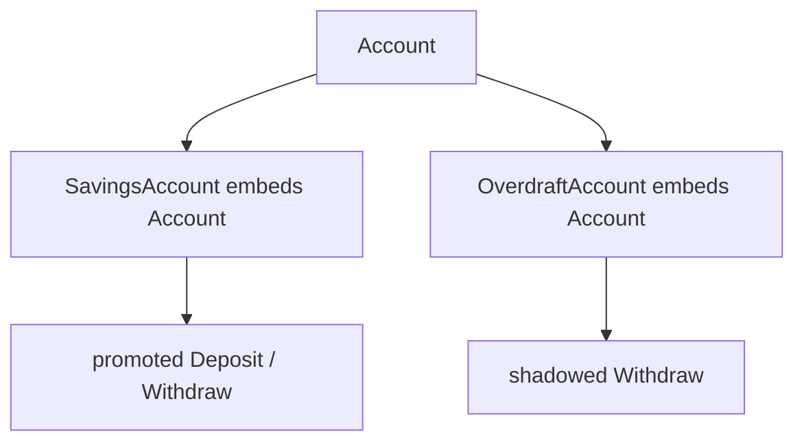

# CO.3 Bank Account Project

## Mission

Build a small bank-account model that proves the difference between named-field composition, embedding, promoted methods, and method shadowing.

> **Backward Reference:** In [Lesson 2: Embedding](../2-embedding/README.md), you learned the mechanics of promoted methods and fields. Now you will apply those mechanics to build a realistic system that requires careful use of both composition and method shadowing to handle different business rules.

## Prerequisites

- `CO.1` composition
- `CO.2` embedding

## Mental Model

This milestone combines two ideas:

- composition lets one type contain another
- embedding promotes inner fields and methods to the outer type

The important question is not "what can I inherit?" It is "what behavior should I reuse, and where should I override it?"

## Visual Model



## Machine View

Embedded fields are still ordinary fields inside the outer struct. Promotion is a syntax shortcut that lets the outer type access inner methods and fields directly. When the outer type defines a method with the same name, that outer method wins.

## Run Instructions

```bash
go run ./04-types-design/composition/3-bank-account
go run ./04-types-design/composition/3-bank-account/_starter
go test ./04-types-design/composition/3-bank-account
```

## Solution Walkthrough

### Shared `Account` type

The reusable account type owns the common balance-changing behavior.

### `SavingsAccount`

This type embeds `Account` and adds interest behavior without copying the base methods.

### `OverdraftAccount`

This type also embeds `Account`, but it shadows `Withdraw` because overdraft rules differ from the base behavior.

### Promoted methods

Embedding allows callers to use base behavior directly on the outer type without verbose field access.

### Tests

The tests prove that ordinary withdraw, interest behavior, and overdraft behavior all still match the intended contract.

## Try It

1. Add another account type with different rules.
2. Change the overdraft limit and rerun the tests.
3. Call a promoted method through the embedded field explicitly and compare it to the promoted form.

## Verification Surface

```bash
go run ./04-types-design/composition/3-bank-account
go run ./04-types-design/composition/3-bank-account/_starter
go test ./04-types-design/composition/3-bank-account
```

## In Production
Composition and embedding show up in data models, adapters, wrappers, and reusable components. Teams get into trouble when they describe embedding as inheritance and stop reasoning about the actual field and method behavior.

## Thinking Questions
1. Why is shadowing different from inheritance-based overriding?
2. When is embedding clearer than a named field, and when is it less clear?
3. What behavior belongs in the shared `Account` type, and what behavior should stay in outer types?

> **Forward Reference:** You have learned how to build complex structures. Now we will focus on one of the most common types in any program: text. In [Lesson 1: Strings](../../strings-and-text/1-strings/README.md), you will go beyond basic text and learn how Go handles UTF-8, runes, and memory-efficient string manipulation.

## Next Step

Continue to `ST.1` strings.
