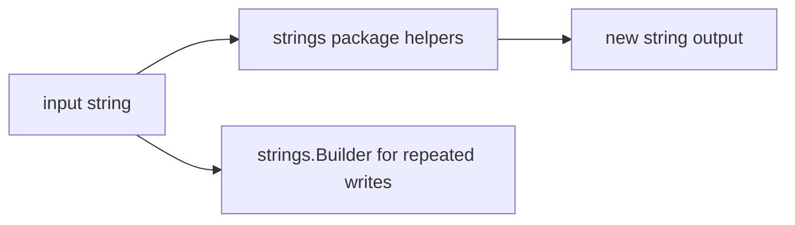

# ST.1 Strings

## Mission

Learn how Go strings behave and how the `strings` package helps transform text safely and efficiently.

> **Backward Reference:** In [Lesson 3: Bank Account Project](../../composition/3-bank-account/README.md), you learned how to build complex systems. Now we shift our focus to the most common data type in any system: Text. Understanding how Go handles strings is critical for building efficient and reliable applications.

## Prerequisites

- `GT.2` hello world
- `LB.1` variables

## Mental Model

A Go string is immutable text data.

That means:

- you can read it freely
- helper functions return new strings instead of changing the original
- repeated concatenation can get expensive

## Visual Model



## Machine View

Go stores a string as a small header pointing at bytes plus a length. Because strings are immutable, operations like trim, replace, and case conversion produce new string values instead of mutating the old one.

## Run Instructions

```bash
go run ./04-types-design/strings-and-text/1-strings
```

## Code Walkthrough

### `strings.ToLower(...)` and `strings.ToUpper(...)`

These convert text case without modifying the original string.

### `strings.TrimSpace(...)`

This is a common cleanup step for user input and config values.

### `strings.Contains(...)`, `HasPrefix(...)`, `HasSuffix(...)`

These helpers answer common search questions about text.

### `strings.Split(...)`, `Fields(...)`, and `Join(...)`

These functions move between one string and many strings.

### `strings.Builder`

The builder is the efficient choice when constructing a string piece by piece in a loop.

## Try It

1. Change the sample input strings and rerun the lesson.
2. Replace one `Split` example with `Fields` and compare the result.
3. Add another value to the builder loop.

## In Production
Text handling shows up everywhere: logs, config, CLI output, HTTP headers, and user input. Understanding immutability and choosing `strings.Builder` in hot loops prevents both bugs and unnecessary allocations.

## Thinking Questions
1. Why does immutability make string code easier to reason about?
2. When is `strings.Builder` a better choice than `+` concatenation?
3. Why are trim and search helpers so common in backend code?

> **Forward Reference:** You have learned how to manipulate strings. Now we will look at how to format them for display. In [Lesson 2: Formatting String](../2-formatting-string/README.md), you will explore the power of the `fmt` package and how to create beautifully formatted output for logs and user interfaces.

## Next Step

Next: `ST.2` -> `04-types-design/strings-and-text/2-formatting-string`

Open `04-types-design/strings-and-text/2-formatting-string/README.md` to continue.
