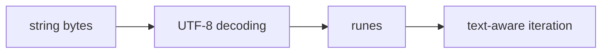

# ST.3 Unicode and Runes

## Mission

Learn the difference between bytes, runes, and UTF-8 text in Go.

> **Backward Reference:** In [Lesson 2: Formatting String](../2-formatting-string/README.md), you learned how to display text. Now we look at the bytes and runes that make up that text, ensuring you can handle international characters and symbols safely.

## Prerequisites

- `ST.1` strings

## Mental Model

In Go, a string is a sequence of bytes, but text is often made of Unicode code points called runes.

That means:

- `len(s)` counts bytes
- `for range` walks runes
- one visible character may use more than one byte

## Visual Model



## Machine View

UTF-8 is a variable-width encoding. ASCII characters use one byte, but many other characters use multiple bytes. Go's `for range` decodes UTF-8 into runes as it iterates.

## Run Instructions

```bash
go run ./04-types-design/strings-and-text/3-unicode
```

## Code Walkthrough

### `len(text)` vs `utf8.RuneCountInString(text)`

This is the core difference between byte length and rune count.

### `[]byte(text)`

Viewing the underlying bytes shows why a character like `é` uses more than one byte.

### `[]rune{...}`

Rune literals demonstrate that a rune represents one Unicode code point.

### `for i, r := range greeting`

This is the correct default pattern for iterating over text rather than raw bytes.

### `unicode.IsLetter(...)` and friends

The `unicode` package helps classify characters during validation and parsing.

## Try It

1. Replace the sample text with other non-ASCII characters.
2. Compare byte length and rune count for an emoji-containing string.
3. Add another `unicode` classification check.

## In Production
Unicode bugs are real production bugs. Counting bytes when you meant characters, slicing inside a multi-byte character, or iterating text incorrectly leads to broken validation, mangled UI text, and corrupted logs.

## Thinking Questions
1. Why is `len(s)` not enough for many text problems?
2. Why is `for range` a safer default than indexing byte-by-byte?
3. What kinds of systems fail when they confuse bytes with characters?

> **Forward Reference:** You now understand the basic building blocks of text in Go. For the next level of text processing, we look at pattern matching. In [Lesson 4: Regex](../4-regex/README.md), you will learn how to use regular expressions to find, validate, and extract complex data from strings.

## Next Step

Continue to `ST.4` regex.
