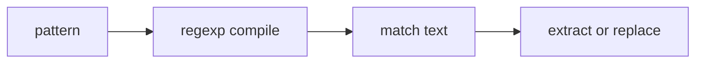

# ST.4 Regex

## Mission

Learn how Go compiles, matches, extracts, and replaces text patterns with regular expressions.

## Prerequisites

- `ST.1` strings
- `ST.3` unicode and runes

## Mental Model

A regular expression is a compact matching rule.

In Go, the usual workflow is:

1. compile the pattern
2. apply it to input text
3. inspect matches, captures, or replacements

## Visual Model



## Machine View

Go's `regexp` package uses the RE2 engine, which guarantees linear-time matching and avoids catastrophic backtracking. Compiled patterns are reusable objects that should be created once when the pattern is stable.

## Run Instructions

```bash
go run ./04-types-design/strings-and-text/4-regex
```

## Code Walkthrough

### `regexp.MustCompile(...)`

This is the right choice for hardcoded patterns that should fail immediately if invalid.

### `MatchString(...)`

This answers the simplest question: does the input match the pattern?

### `FindAllString(...)`

This extracts multiple matches from larger text.

### `FindStringSubmatch(...)`

Capture groups let the program pull structured data out of free-form text.

### `ReplaceAllString(...)` and `ReplaceAllStringFunc(...)`

These make regex useful for sanitizing and transforming text, not only matching it.

## Try It

1. Change the email pattern and inspect which inputs still match.
2. Add another log line for the capture-group example.
3. Replace a different sensitive pattern with a masked value.

## ⚠️ In Production

Regex is powerful but easy to misuse. Precompiling patterns, keeping expressions readable, and understanding the engine's guarantees are what keep parsing code fast and maintainable.

## 🤔 Thinking Questions

1. Why is `MustCompile` appropriate for hardcoded patterns?
2. When do capture groups matter more than plain matching?
3. Why is Go's RE2 choice operationally important?

## Next Step

Continue to `ST.5` text templates.
