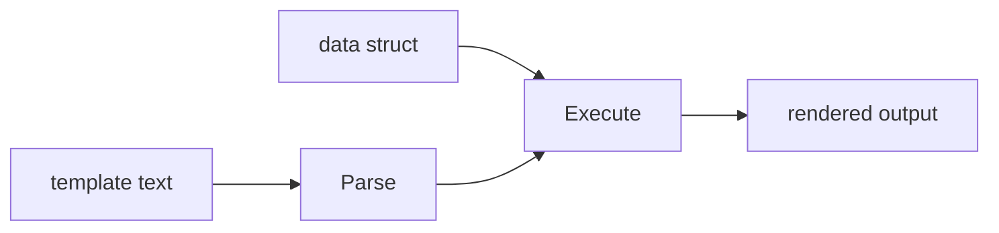

# ST.5 Text Templates

## Mission

Learn how Go separates presentation from data with `text/template`.

> **Backward Reference:** In [Lesson 4: Regex](../4-regex/README.md), you learned how to pull data OUT of text. Now we look at the reverse: how to put data INTO text using Go's powerful templating engine to generate dynamic and well-structured output.

## Prerequisites

- `ST.1` strings
- `ST.2` formatting

## Mental Model

Templates let you describe output structure separately from the data that fills it in.

The flow is:

1. define a template
2. parse it
3. execute it with data
4. collect or print the rendered output

## Visual Model



## Machine View

`text/template` parses template source into an internal syntax tree. During execution, it uses reflection to read exported fields from the provided data and write rendered output to an `io.Writer`.

## Run Instructions

```bash
go run ./04-types-design/strings-and-text/5-text-template
```

## Code Walkthrough

### `type EmailData struct { ... }`

The struct provides the fields the template is allowed to read.

### `template.New(...).Parse(...)`

Parsing turns raw template text into a reusable compiled template object.

### Template actions like `{{if ...}}` and `{{range ...}}`

These actions add conditional and loop behavior inside the template itself.

### `strings.Builder`

The builder captures rendered output efficiently before the lesson prints it.

### `tmpl.Execute(&output, data)`

Execution walks the parsed template and fills in the placeholders from the provided data.

## Try It

1. Add another field to `EmailData` and render it.
2. Change the `if` branch by adjusting `UnreadCount`.
3. Add another item to the `Items` slice and inspect the `range` output.

## In Production
Templates are how teams generate emails, config files, reports, and stable text output without mixing presentation logic into business logic. The separation pays off quickly as systems grow.

## Thinking Questions
1. Why is parsing once and executing many times a good design?
2. Why must template-visible struct fields be exported?
3. When is a template clearer than a long chain of manual string concatenation?

> **Forward Reference:** You have learned the core text processing tools: manipulation, formatting, Unicode, Regex, and Templating. Now it is time to build a real-world tool. In [Lesson 6: Config Parser Project](../6-config-parser/README.md), you will build a configuration parser that uses everything you have learned to process complex text files.

## Next Step

Continue to `ST.6` config parser project.
