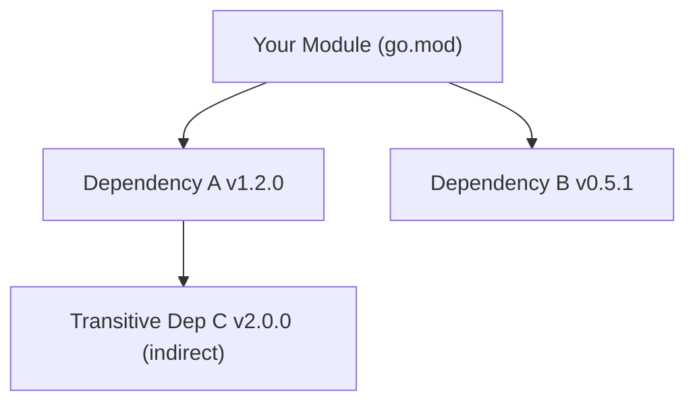

# MP.1 Module Basics

## Mission

Learn the fundamentals of Go Modules and how they manage project identity and dependency resolution.

## Prerequisites

- `ST.6` config-parser-project (completion of Section 04)

## Mental Model

Think of a Go Module as a **Project Passport**.

It defines:
- **Who you are**: The module path (e.g., `github.com/user/repo`).
- **What you need**: A list of required dependencies and their exact versions.
- **Verification**: Proof (checksums) that the dependencies haven't been tampered with.

## Visual Model



## Machine View

The `go.mod` file is a plain text file that Go tools use to build a dependency graph. When you run `go build`, Go looks at `go.mod` to find the required versions, then checks `go.sum` to verify the cryptographic hashes of the downloaded code. The actual source code is cached locally in `$GOPATH/pkg/mod`.

## Run Instructions

```bash
go run ./05-packages-io/01-modules-and-packages/1-module-basics
```

## Code Walkthrough

### The `go.mod` File
The root of every modern Go project. It contains the `module` directive and the `go` version directive.

### `go mod tidy`
The most important command. It adds missing module requirements for imported packages and removes requirements that aren't used anymore.

### `go.sum`
The lock file. It ensures that every person (or CI runner) who builds your project uses the exact same bytes for dependencies.

## Try It

1. Run `go mod graph` in the root of this repository to see the full dependency tree.
2. Run `go mod verify` to check if your local cache matches the `go.sum` entries.
3. Try running `go list -m all` to see a flat list of everything your project depends on.

## In Production
Never manually edit `go.sum`. If you have a checksum mismatch, it usually means a dependency was retracted or tampered with. Use `go mod tidy` to resolve most module issues. Always commit both `go.mod` and `go.sum` to version control.

## Thinking Questions
1. Why is a `go.sum` file necessary if we already specify versions in `go.mod`?
2. What is the difference between a direct and an indirect dependency?
3. Why should the module path usually match the repository URL?

> **Forward Reference:** Now that you understand how modules identify themselves and their needs, we will look at how to actually add, update, and remove external libraries. In [Lesson 2: Managing Dependencies](../2-managing-deps/README.md), you will learn the `go get` workflow.

## Next Step

Continue to `MP.2` managing-deps.
