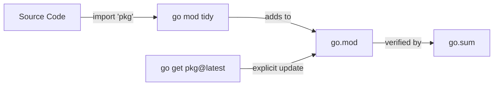

# MP.2 Managing Dependencies

## Mission

Learn how to add, update, and remove external libraries in a Go project using the `go get` and `go mod` tools.

## Prerequisites

- `MP.1` module-basics

## Mental Model

Think of dependency management as **Inventory Control**.

- **Ordering**: You request a specific package with `go get`.
- **Auditing**: Go checks if the package is already in your "warehouse" (local cache).
- **Invoicing**: Go updates `go.mod` to record the change.
- **Cleaning**: `go mod tidy` sweeps the floor, removing any "boxes" (imports) you're no longer using.

## Visual Model



## Machine View

When you `go get` a package, Go downloads the source code into `$GOPATH/pkg/mod`, verifies its checksum against `go.sum` (or the Go Checksum Database), and updates the `require` block in `go.mod`. Go uses **Minimal Version Selection (MVS)** to resolve version conflicts, favoring the oldest possible version that satisfies all requirements to maximize stability.

## Run Instructions

```bash
go run ./05-packages-io/01-modules-and-packages/2-managing-deps
```

## Code Walkthrough

### `go get <package>@<version>`
This is how you explicitly change a dependency version. Use `@latest` for the newest stable release, or a specific tag like `@v1.2.3`.

### `go mod why <package>`
A critical tool for debugging large projects. It traces the shortest path from your project to a specific dependency, showing you exactly which of your direct imports is pulling it in.

### `exec.Command("go", "list", "-m", "all")`
The code in this lesson actually calls the Go tool itself to inspect the current project's state. This demonstrates how Go tools are designed to be composable.

## Try It

1. Try adding a small utility library: `go get github.com/google/uuid`.
2. Look at your `go.mod` file to see the new entry.
3. Run `go mod tidy` to ensure everything is clean.
4. Run `go mod why github.com/stretchr/objx` in the repository root to see why that specific testing utility is present.

## In Production
Dependency bloat is a security risk. Every library you add increases your "attack surface." Use `govulncheck` (part of the Go toolchain) to scan your dependencies for known security vulnerabilities regularly.

## Thinking Questions
1. Why is `go mod tidy` usually better than manually editing `go.mod`?
2. What happens if two different dependencies require two different versions of the same library?
3. Why does Go favor "Minimal Version Selection" over always using the absolute latest version?

> **Forward Reference:** You can now manage external code. But how do you decide which version number to use? In [Lesson 3: Versioning](../3-versioning/README.md), you will learn about Semantic Versioning (SemVer) and Go's unique compatibility rules.

## Next Step

Next: `MP.3` -> `05-packages-io/01-modules-and-packages/3-versioning`

Open `05-packages-io/01-modules-and-packages/3-versioning/README.md` to continue.
