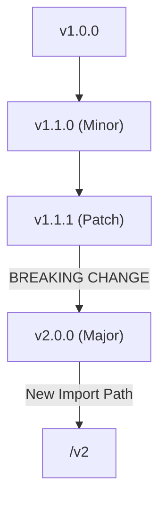

# MP.3 Versioning Workshop

## Mission

Build a small semantic-versioning and module-policy demo that makes Go's version rules concrete. This exercise is the Section 05 milestone.

## Prerequisites

- `MP.1` module-basics
- `MP.2` managing-deps

## Mental Model

Think of Semantic Versioning (SemVer) as a **Contract**.

- **v1.2.3**
- **1 (Major)**: You tore up the old contract. Users must sign a new one (update code).
- **2 (Minor)**: You added a new clause. The old contract still works (backward compatible).
- **3 (Patch)**: You fixed a typo. No change to the contract (bug fix).

## Visual Model



## Machine View

Go enforces the **Semantic Import Versioning** rule. For major versions `v0` and `v1`, the import path remains the same. For `v2` and higher, the major version must be part of the import path (e.g., `github.com/user/repo/v2`). This allows a single Go binary to include multiple incompatible versions of the same library simultaneously, resolving the "diamond dependency" problem.

## Run Instructions

```bash
go run ./05-packages-io/01-modules-and-packages/3-versioning
```

## Solution Walkthrough

- **Version Struct**: We model the version as three distinct integers to demonstrate that comparison is numerical, not lexicographical (e.g., `1.10.0` is newer than `1.9.0`).
- **IsCompatible Method**: This method checks the major version boundary. In Go, as long as the major version matches, the library is considered backward compatible.
- **The /v2 Rule**: The demo prints how import paths shift when moving from v1 to v2. This is the most unique and important part of Go's module system.

## Try It

1. Modify the `versions` slice in `main.go` to include a version that triggers the "BREAKING CHANGE" warning.
2. Implement a `IsPrerelease` field in the `Version` struct and handle tags like `v1.0.0-beta`.
3. Experiment with the `replace` directive in your own project to see how it overrides version resolution.

## Verification Surface

- Use `go run ./05-packages-io/01-modules-and-packages/3-versioning`.
- Starter path: `05-packages-io/01-modules-and-packages/3-versioning/_starter`.


## In Production
Breaking the major version boundary without updating the import path is a "contract violation." It will cause build failures for your users. If you maintain a public library, always prefer adding new, non-breaking functions over breaking existing ones.

## Thinking Questions
1. Why does Go require a new import path (`/v2`) for major version bumps?
2. How does the `/v2` rule help resolve conflicts where two of your dependencies require different major versions of a third library?
3. When should you use the `replace` directive in a production `go.mod` file?

> [!TIP]
> You now understand how versions are managed and enforced. But how do you handle different versions of your own code for different environments (e.g., Windows vs Linux)? In [Lesson 4: Build Tags](../4-build-tags/README.md), you will learn how to control which files are included in your binary.

## Next Step

Next: `MP.4` -> [`05-packages-io/01-modules-and-packages/4-build-tags`](../4-build-tags/README.md)
