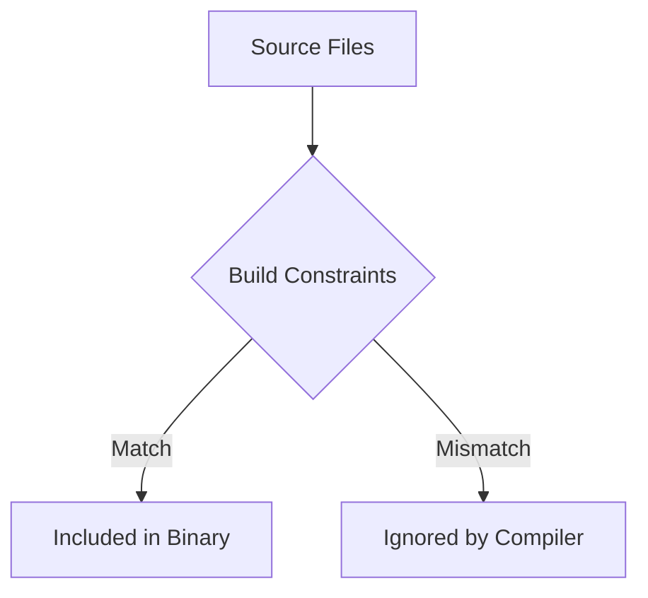

# MP.4 Build Tags

## Mission

Learn how to use build constraints (`//go:build`) to conditionally compile code and separate platform-specific or environment-specific logic.

## Prerequisites

- `MP.3` versioning-workshop

## Mental Model

Think of Build Tags as **Custom Filters** for the compiler.

When you run `go build`, the compiler looks at every file and asks:
1. Does this file match the current OS/Architecture?
2. Does it have a `//go:build` tag?
3. If it has a tag, does that tag match the build flags provided by the user?

Only the files that pass the filters are included in the final binary.

## Visual Model



## Machine View

Build tags are processed at the very beginning of the compilation pipeline. Files that don't match the tags are discarded before the compiler even begins parsing them. This means you can have syntax in a `//go:build linux` file that would be invalid on Windows (e.g., using specific syscalls), and the Windows build will still succeed because it never "sees" the Linux-specific file.

## Run Instructions

```bash
go run ./05-packages-io/01-modules-and-packages/4-build-tags
```

Try running with a custom tag for the tests:
```bash
go test -v -tags=integration ./05-packages-io/01-modules-and-packages/4-build-tags
```

## Code Walkthrough

### `os_windows.go` and `os_unix.go`
These files use **Implicit Build Tags**. The Go compiler automatically recognizes filenames ending in `_windows.go`, `_linux.go`, `_darwin.go`, etc., and treats them as if they had the corresponding `//go:build` tag at the top.

### `//go:build integration`
This is an **Explicit Build Tag**. It's used in `integration_test.go` to ensure those tests only run when the developer explicitly requests them.

### `runtime.GOOS`
The code uses the `runtime` package to inspect the OS it was actually compiled for, confirming that the correct platform-specific file was selected.

## Try It

1. Create a new file `extra_feature.go` with `//go:build extra`.
2. Try to call a function from that file in `main.go`.
3. Build the project: `go build`. It should fail because the function is missing.
4. Build with the tag: `go build -tags=extra`. Now it succeeds!

## In Production
Overusing build tags can make code difficult to navigate for IDEs and static analysis tools. Always provide a "default" implementation or an interface to ensure your project remains readable even when specific tags aren't active.

## Thinking Questions
1. Why is separating integration tests behind a build tag a good engineering practice?
2. What is the difference between an implicit build tag in a filename and an explicit `//go:build` comment?
3. How would you handle a feature that is only available on Go version 1.21 or higher?

> **Forward Reference:** You have mastered how Go code is organized and compiled. Now we will look at how to interact with the outside world through the command line. In [Lesson 1: Args](../../02-io-and-cli/cli-tools/1-args/README.md), you will learn how to read raw command-line arguments.

## Next Step

Continue to `CL.1` args.
