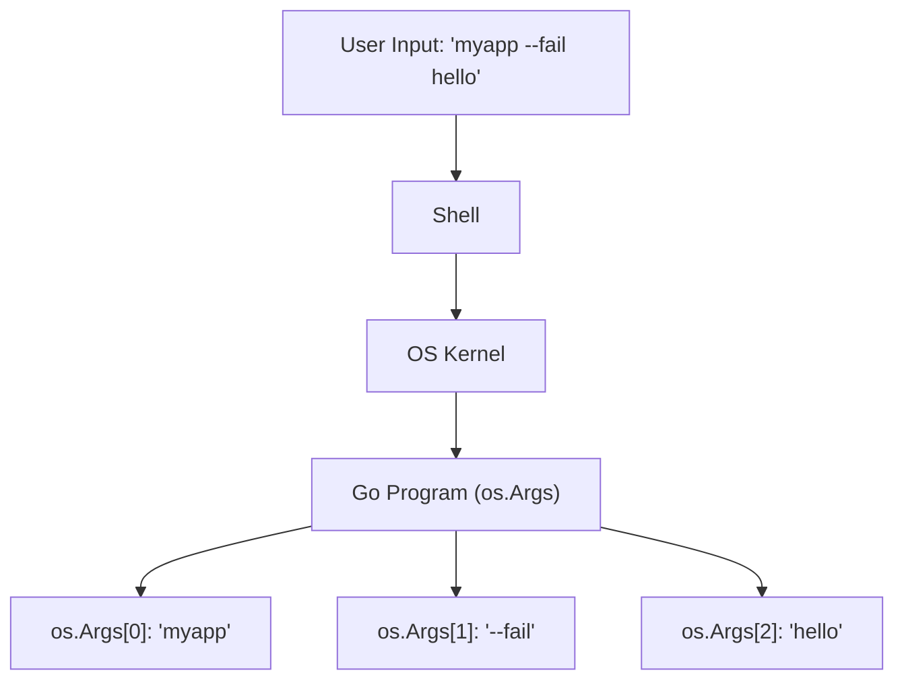

# CL.1 Args

## Mission

Learn how to read and process raw command-line arguments and environment variables in Go.

## Prerequisites

- `MP.4` build-tags

## Mental Model

Think of Command-Line Arguments as **Launching Instructions**.

When you start a program, you can pass it extra information (arguments) like a list of files to process, or a username to greet. Environment variables are like **Persistent Settings** that stay in the background and are available to any program started in that session.

## Visual Model



## Machine View

The operating system passes command-line arguments to a new process as a null-terminated array of strings (in C, this is `argv`). Go's `os` package converts this array into a slice of strings (`[]string`) called `os.Args`. Accessing an index outside the slice boundaries will cause a runtime panic, so robust programs always check the length of `os.Args` first.

## Run Instructions

```bash
go run ./05-packages-io/02-io-and-cli/cli-tools/1-args
```

Try passing arguments:
```bash
go run ./05-packages-io/02-io-and-cli/cli-tools/1-args hello world
```

Try setting an environment variable:
```bash
GREETING=Howdy go run ./05-packages-io/02-io-and-cli/cli-tools/1-args
```

## Code Walkthrough

### `os.Args`
The primary way to read inputs. Remember that `os.Args[0]` is always the path to the executable itself.

### `os.Getenv`
Used to read environment variables. It returns an empty string if the variable is not set. For mission-critical variables (like database passwords), you should check if the result is empty and handle it appropriately.

### `os.Exit`
Exits the program immediately with a status code. `0` indicates success, while non-zero values indicate various types of errors. Note that `defer` statements are **not** executed when `os.Exit` is called.

## Try It

1. Run the program with the `--fail` argument to see how exit codes work.
2. Modify the code to print all arguments in uppercase.
3. Add a check for a required environment variable (e.g., `APP_ENV`) and exit with an error if it's missing.

## In Production
For complex CLI tools, raw `os.Args` can become difficult to manage. For simple flags, use the `flag` package (Lesson 2). For large CLI applications with many commands and nested flags, industry-standard libraries like `cobra` are preferred.

## Thinking Questions
1. Why is `os.Args[0]` included in the slice instead of just starting with the first user argument?
2. What are the security implications of reading sensitive data from command-line arguments (which might show up in process lists like `ps`)?
3. When should you use an environment variable instead of a command-line argument?

> **Forward Reference:** Raw arguments are great for simple scripts, but as your tool grows, you will need a more structured way to handle options. In [Lesson 2: Flags](../2-flags/README.md), you will learn how to use the standard library `flag` package to parse named options and typed values.

## Next Step

Continue to `CL.2` flags.
