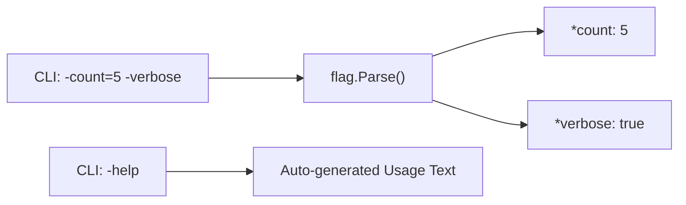

# CL.2 Flags

## Mission

Learn how to use the standard library `flag` package to parse typed command-line options with default values and automatic help generation.

## Prerequisites

- `CL.1` args

## Mental Model

Think of the `flag` package as a **Form Processor** for the command line.

Instead of manually checking `os.Args` for specific strings, you define "fields" (flags) with:
- **A name**: How the user refers to it (e.g., `-count`).
- **A type**: What kind of data it expects (e.g., `int`).
- **A default value**: What happens if the user says nothing.
- **A description**: What the flag actually does (for the `-help` menu).

## Visual Model



## Machine View

The `flag` package returns **pointers** to variables (`*string`, `*int`, etc.). This is a critical design choice. When you define a flag, the memory is allocated immediately, but the values are only populated once you call `flag.Parse()`. This separation allows you to define flags in global variables or different packages before the program even enters `main()`, but prevents you from accidentally using unparsed values.

## Run Instructions

```bash
go run ./05-packages-io/02-io-and-cli/cli-tools/2-flags
```

Try passing typed flags:
```bash
go run ./05-packages-io/02-io-and-cli/cli-tools/2-flags -name="Gopher" -count=5 -verbose
```

Check the auto-generated help:
```bash
go run ./05-packages-io/02-io-and-cli/cli-tools/2-flags -help
```

## Code Walkthrough

### `flag.String(...)`, `flag.Int(...)`
These functions define your expected flags. They return pointers to the underlying values.

### `flag.Parse()`
The most important call. It scans `os.Args[1:]`, identifies the flags you defined, converts the string inputs to the correct types, and populates your pointers.

### `flag.Args()`
Returns any "leftover" arguments that weren't part of a flag (e.g., in `myapp -v file.txt`, `file.txt` would be in `flag.Args()`).

## Try It

1. Add a `flag.Duration` to control a sleep time between greetings.
2. Change the default value of the `separator` flag.
3. Try to pass an invalid type (e.g., `-count=abc`) and observe the built-in error handling.

## In Production
The standard `flag` package uses the single-dash format (`-flag`) which is slightly different from the GNU double-dash convention (`--flag`). While `flag` supports both, it's worth noting if you're building tools for users who expect strict POSIX compliance.

## Thinking Questions
1. Why does `flag.Parse()` need to be called after defining flags but before using them?
2. What happens if you define two flags with the same name?
3. How would you handle a flag that is required (no sensible default)?

> [!TIP]
> Flags are great for single-purpose tools. But what if your app has multiple distinct modes (like `git add` and `git commit`)? In [Lesson 3: Subcommands](../3-subcommands/README.md), you will learn how to build multi-command CLI applications.

## Next Step

Next: `CL.3` -> [`05-packages-io/02-io-and-cli/cli-tools/3-subcommands`](../3-subcommands/README.md)
