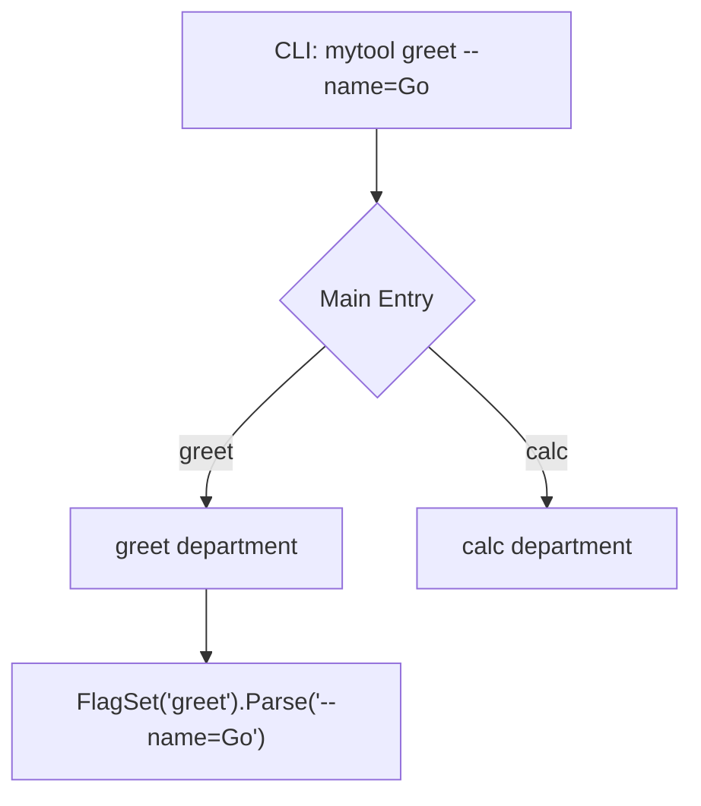

# CL.3 Subcommands

## Mission

Learn how to build multi-command CLI tools (like `git`, `docker`, or `kubectl`) using independent `FlagSet` objects for each command.

## Prerequisites

- `CL.2` flags

## Mental Model

Think of Subcommands as **Departments** in a company.

The "Company" (your program) has a main reception (the `switch` on `os.Args[1]`). Depending on what the user wants to do, they are sent to a specific "Department" (`greet`, `calc`, `version`). Each department has its own set of "Rules" (flags) that don't apply to the other departments.

## Visual Model



## Machine View

In a multi-command CLI, the program first inspects `os.Args[1]` to determine which subcommand was requested. Once the subcommand is identified, the program "strips" the first two arguments (the program name and the subcommand name) and passes the remaining `os.Args[2:]` to a `flag.NewFlagSet`. This `FlagSet` operates exactly like the global `flag` package but is isolated, meaning the "help" text and flag definitions are specific to that command only.

## Run Instructions

```bash
go run ./05-packages-io/02-io-and-cli/cli-tools/3-subcommands
```

Try different subcommands:
```bash
go run ./05-packages-io/02-io-and-cli/cli-tools/3-subcommands greet -name="Gopher" -loud
go run ./05-packages-io/02-io-and-cli/cli-tools/3-subcommands calc -a=10 -b=5 -op=sub
go run ./05-packages-io/02-io-and-cli/cli-tools/3-subcommands version
```

Check subcommand-specific help:
```bash
go run ./05-packages-io/02-io-and-cli/cli-tools/3-subcommands greet -help
```

## Code Walkthrough

### `switch os.Args[1]`
The "router". It directs the execution flow based on the first user argument.

### `flag.NewFlagSet(name, errorHandling)`
Creates a new isolated group of flags. `flag.ExitOnError` ensures the program quits gracefully if the user provides invalid flags.

### `fs.Parse(os.Args[2:])`
Parses ONLY the arguments that belong to the subcommand, ignoring the program name and the subcommand name itself.

## Try It

1. Add a new subcommand `stats` that prints the number of arguments provided.
2. Implement a `div` (division) operation in the `calc` subcommand.
3. Make the `version` command print the current OS using `runtime.GOOS`.

## In Production
While `FlagSet` is powerful, complex tools with many nested subcommands (e.g., `docker container run`) are usually built using a library like **Cobra**. Cobra handles help generation, bash completion, and subcommand nesting much more elegantly than manual `switch` statements.

## Thinking Questions
1. Why is it better to use `FlagSet` for subcommands instead of one global set of flags?
2. What happens if a user types a subcommand that doesn't exist?
3. How can you provide a "global" flag that works across all subcommands (e.g., `--verbose`)?

> **Forward Reference:** You now know how to build a sophisticated CLI interface. It's time to put these skills to work. In [Lesson 4: File Organizer Project](../4-file-organizer/README.md), you will build a real-world tool that organizes files into directories based on their extensions.

## Next Step

Continue to `CL.4` file-organizer.
