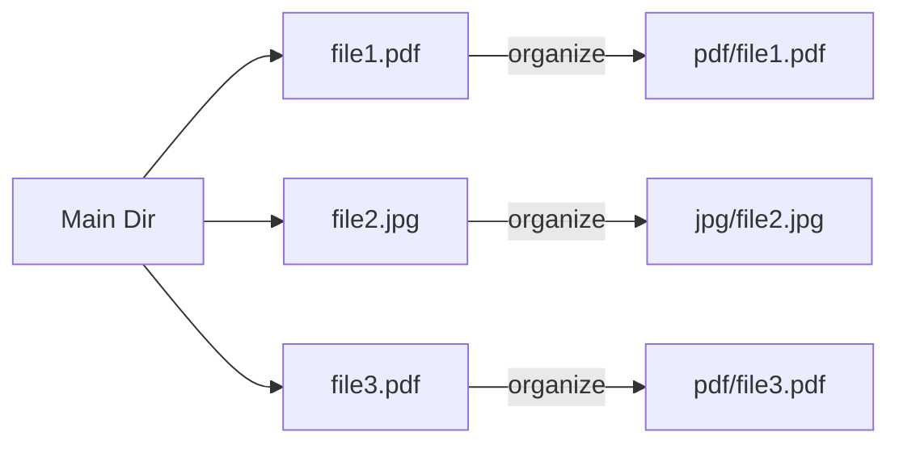

# CL.4 File Organizer Project

## Mission

Build a professional CLI tool that cleans up messy directories by grouping files into subfolders based on their file extensions.

## Prerequisites

- `CL.1` args
- `CL.2` flags
- `CL.3` subcommands

## Mental Model

Think of this tool as a **Sorting Machine**.

1. **Input**: A messy directory full of files.
2. **Analysis**: The tool checks each file's "Label" (extension).
3. **Logistics**: The tool ensures a "Bin" (subdirectory) exists for that label.
4. **Action**: The tool moves the file into the correct bin.

## Visual Model



## Machine View

This tool uses several low-level OS operations:
- `os.ReadDir`: Reads the directory index from the filesystem.
- `os.MkdirAll`: Checks for directory existence and creates it if missing (idempotent operation).
- `os.Rename`: A highly efficient OS operation that updates the directory entry pointers in the filesystem rather than copying the actual file data (when moving within the same partition).
- `filepath`: Ensures the tool works correctly on both Windows (using `\`) and Unix (using `/`).

## Run Instructions

```bash
go run ./05-packages-io/02-io-and-cli/cli-tools/4-file-organizer
```

Run on a specific directory:
```bash
go run ./05-packages-io/02-io-and-cli/cli-tools/4-file-organizer --dir=./my-folder
```

Perform a safe preview (Dry Run):
```bash
go run ./05-packages-io/02-io-and-cli/cli-tools/4-file-organizer --dir=./my-folder --dry-run
```

## Solution Walkthrough

- **--dry-run Flag**: A standard safety pattern in CLI engineering. It allows the tool to log exactly what it *would* do without actually performing the destructive `os.Rename` or `os.MkdirAll` operations.
- **os.ReadDir**: Returns a slice of `DirEntry` objects. We iterate over these, skipping anything that is already a directory to avoid recursive messiness.
- **filepath.Ext**: Extracts the extension from the filename. We then clean it up (removing the dot) to use it as the subdirectory name.
- **os.MkdirAll and os.Rename**: The "Engine" of the tool. `MkdirAll` is called for every file to ensure the target folder exists, and `Rename` moves the file to its new home.

## Try It

1. Add an `--exclude` flag that takes a comma-separated list of extensions to skip.
2. Modify the tool to count how many files of each type were moved and print a summary at the end.
3. Add a `--verbose` flag that prints the full path of every file being moved.

## Verification Surface

- Use `go run ./05-packages-io/02-io-and-cli/cli-tools/4-file-organizer`.
- Starter path: `05-packages-io/02-io-and-cli/cli-tools/4-file-organizer/_starter`.


## In Production
Any tool that moves or deletes files must be treated with extreme caution. Always test with `--dry-run` first. In a production environment, you should also check if the target file already exists before renaming, to prevent accidental data loss from overwriting files with the same name in different source locations.

## Thinking Questions
1. Why is `os.Rename` faster than copying a file and then deleting the original?
2. What happens if the program crashes halfway through organizing a directory with 1,000 files?
3. How would you modify this tool to handle subdirectories recursively?

> **Forward Reference:** You have mastered the art of CLI interaction and basic file manipulation. Now we need to look at how to handle more complex data formats. In [Lesson 1: Marshalling](../../encoding/1-marshalling/README.md), you will learn how to turn Go structs into JSON and XML strings.

## Next Step

Next: `EN.1` -> `05-packages-io/02-io-and-cli/encoding/1-marshalling`

Open `05-packages-io/02-io-and-cli/encoding/1-marshalling/README.md` to continue.
