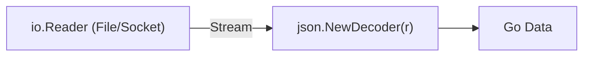

# EN.4 Decode

## Mission

Learn how to use the streaming JSON Decoder to read data directly from an `io.Reader`, enabling efficient processing of large files and continuous data streams.

## Prerequisites

- `EN.3` encoder

## Mental Model

Think of the Decoder as a **Filter at the Intake Pipe**.

Instead of filling a giant tank with data and then sorting it all at once (`json.Unmarshal`), the Decoder sits at the mouth of the pipe. As data flows through, it picks out the pieces it recognizes, fits them into your Go struct, and lets the rest of the bytes wash away.

## Visual Model



## Machine View

The `json.Decoder` maintains an internal buffer (typically a few kilobytes). When you call `Decode()`, it reads from the `io.Reader` into its buffer and begins parsing the JSON tokens. Once it has enough information to populate your struct, it returns. This process repeats until the `io.Reader` returns `io.EOF` (End Of File). This approach is "memory-constant"-the amount of RAM used does not increase even if the input file is 100 gigabytes.

## Run Instructions

```bash
go run ./05-packages-io/02-io-and-cli/encoding/4-decode
```

## Code Walkthrough

### `json.NewDecoder(r)`
Initializes a decoder that will pull data from any `io.Reader` (e.g., an `os.File`, `strings.Reader`, or `http.Request.Body`).

### `dec.Decode(&v)`
Reads the next JSON object from the stream and unmarshals it into `v`. Note that you must still pass a pointer.

### `io.EOF`
A special error that signals the end of the input stream. In a loop, you should check for this specific error to know when to stop decoding.

### Multi-Object Streams
Unlike `json.Unmarshal`, which expects one single JSON value, the Decoder can handle multiple JSON objects placed one after another in a stream (often called **JSON Lines** or **NDJSON**).

## Try It

1. Create a large text file containing 100 valid JSON objects and use the Decoder to count them.
2. Intentionally corrupt one of the JSON objects in the middle of a stream and see how the Decoder handles the error.
3. Use `json.NewDecoder(os.Stdin)` to create a tool that parses JSON piped from another command.

## In Production
For web servers, always use `json.NewDecoder(r.Body).Decode(&v)` instead of reading the body into a byte slice. This prevents a common class of "Denial of Service" (DoS) attacks where a client sends a massive JSON payload to exhaust the server's memory.

## Thinking Questions
1. Why is `io.EOF` treated differently from other errors during decoding?
2. What happens if a stream contains a JSON array instead of separate JSON objects?
3. How does the Decoder know where one JSON object ends and the next one begins?

> **Forward Reference:** You have mastered JSON, the standard for text-based data exchange. But sometimes you need to handle binary data or pass non-text values through text-only systems. In [Lesson 5: Base64](../../encoding/5-base64_encoding/README.md), you will learn how to encode and decode binary data using Base64.

## Next Step

Next: `EN.5` -> `05-packages-io/02-io-and-cli/encoding/5-base64_encoding`

Open `05-packages-io/02-io-and-cli/encoding/5-base64_encoding/README.md` to continue.
