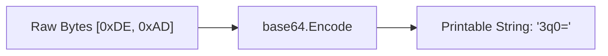

# EN.5 Base64 Encoding

## Mission

Learn how to encode binary data into text-safe strings using Base64, and understand when to use Standard vs URL-safe encodings.

## Prerequisites

- `EN.4` decode

## Mental Model

Think of Base64 as a **Luggage Tag for Binary Data**.

Some "Transport Systems" (like URLs or HTTP Headers) can only handle "Standard Text" (A-Z, 0-9). If you try to send "Raw Binary" (like an image file or a secret key), it might get mangled or rejected. Base64 takes those "Raw Bytes" and translates them into a specific alphabet of 64 printable characters that are guaranteed to survive the journey.

## Visual Model



## Machine View

Base64 works by taking groups of 3 bytes (24 bits) and splitting them into 4 groups of 6 bits each. Each 6-bit group represents a number from 0 to 63, which maps to a character in the Base64 alphabet (A-Z, a-z, 0-9, +, /). Because 3 bytes become 4 characters, the data size increases by exactly 33.3%. If the input bytes aren't a multiple of 3, "padding" characters (`=`) are added to the end to maintain the alignment.

## Run Instructions

```bash
go run ./05-packages-io/02-io-and-cli/encoding/5-base64_encoding
```

## Code Walkthrough

### `base64.StdEncoding`
The standard encoder used for JSON, emails, and general data transport. It uses the `+` and `/` characters.

### `base64.URLEncoding`
A specialized version that replaces `+` with `-` and `/` with `_`. This is essential when putting Base64 data into a URL, as `+` and `/` have special meanings in web addresses that would cause the data to be misinterpreted.

### `EncodeToString` and `DecodeString`
Helper functions that handle the conversion between `[]byte` and `string` automatically, making the common case very simple to implement.

## Try It

1. Encode a small image file (or any non-text file) and print the resulting string.
2. Compare the output of `StdEncoding` and `URLEncoding` for a string that contains characters resulting in `+` or `/` (like many long tokens).
3. Try decoding a string that isn't valid Base64 and observe the error.

## In Production
**Base64 is NOT encryption.** It provides zero security. Anyone who sees a Base64 string can decode it back to the original bytes in milliseconds. Never use Base64 as a substitute for real encryption (like AES or RSA). It is strictly a format for **transporting** data, not securing it.

## Thinking Questions
1. Why does Base64 data take up more space than the original binary data?
2. When would using `URLEncoding` be mandatory instead of `StdEncoding`?
3. How can you tell if a string is likely Base64 encoded just by looking at it?

> [!TIP]
> You now know how to handle text, JSON, and binary data transport. It's time to build a more complex system that uses these skills. In [Lesson 6: Config Parser Project](../6-config-parser/README.md), you will build a robust configuration parser that handles multiple formats and complex mapping.

## Next Step

Next: `EN.6` -> [`05-packages-io/02-io-and-cli/encoding/6-config-parser`](../6-config-parser/README.md)
