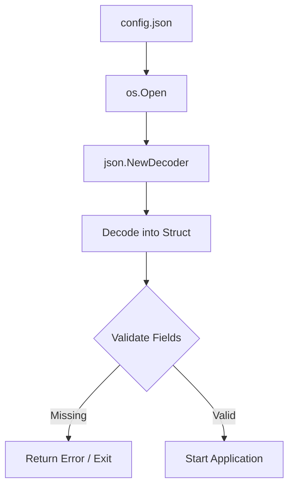

# EN.6 Config Parser Project

## Mission

Build a robust application configuration loader that reads from disk, decodes from a JSON stream, and performs post-parse validation to ensure the program has all necessary settings to start.

## Prerequisites

- `EN.1` marshalling
- `EN.2` unmarshal
- `EN.4` decode

## Mental Model

Think of a Config Parser as the **Pre-Flight Checklist** for a pilot.

Before the plane (your application) takes off, you must check that:
1. The **Flight Plan** (the config file) is readable.
2. The **Instructions** (the JSON) are formatted correctly.
3. All **Critical Systems** (required fields like `Port` and `DatabaseURL`) have been initialized.

If any of these checks fail, the plane should never leave the ground.

## Visual Model



## Machine View

This project brings together filesystem I/O and JSON streaming. By using `json.NewDecoder(file)`, we pipe the file contents directly into the JSON parser. This is more efficient than loading the whole file into memory first. Crucially, we implement a `validate()` method because Go's `json` package silently ignores missing fields (assigning them their zero values). Without validation, your app might try to connect to an empty database URL or start on port 0, leading to confusing runtime errors.

## Run Instructions

```bash
go run ./05-packages-io/02-io-and-cli/encoding/6-config-parser
```

## Solution Walkthrough

- **AppConfig Struct**: Defines the schema of our configuration. We use struct tags to match JSON keys like `app_name` to Go fields like `AppName`.
- **loadConfig Function**: Handles the "Boilerplate" of file management: opening the file, ensuring it's closed (`defer`), creating the decoder, and finally triggering the validation.
- **validate() Method**: This is a "Sanity Check". It inspects each critical field in the populated struct. If a field like `AppName` is still its zero value (`""`), it means the field was either missing from the JSON or was explicitly set to an empty string-both of which are invalid for our app.

## Try It

1. Change the sample JSON to remove a required field like `port` and observe the validation error.
2. Add a new required field `Environment` (e.g., "production", "staging") and update the validation logic.
3. Modify `loadConfig` to allow an optional environment variable to override the config file path.

## Verification Surface

- Use `go run ./05-packages-io/02-io-and-cli/encoding/6-config-parser`.
- Starter path: `05-packages-io/02-io-and-cli/encoding/6-config-parser/_starter`.


## In Production
In real-world applications, you might want to support multiple formats like YAML or TOML. Libraries like **Viper** are industry standard for this, as they handle file loading, environment variable overrides, and default values in a single package. However, understanding the manual process with the standard library is essential for debugging and building simpler, low-dependency tools.

## Thinking Questions
1. Why is validation done *after* decoding rather than *during* decoding?
2. What are the benefits of using `json.NewDecoder` over `os.ReadFile` for configuration?
3. How would you handle a configuration where some fields are only required if `Debug` is set to `false`?

> **Forward Reference:** You have mastered how data is structured and transported. Now we will look deeper into how data is actually stored and managed on the disk. In [Lesson 1: Files](../../filesystem/1-files/README.md), you will learn the core concepts of file descriptors and I/O modes.

## Next Step

Next: `FS.1` -> `05-packages-io/02-io-and-cli/filesystem/1-files`

Open `05-packages-io/02-io-and-cli/filesystem/1-files/README.md` to continue.
