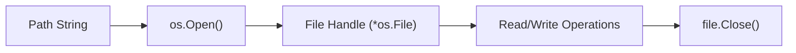

# FS.1 Files

## Mission

Learn how to open, read, write, and close files safely in Go.

## Why This Lesson Exists Now

Files are the most common way programs store and exchange data. In Go, interacting with files is done through the `os` package, and it provides a great opportunity to practice resource management and error handling.

## Prerequisites

- `CF.6` defer use cases
- `EN.4` JSON decoder (optional)

## Mental Model

Think of a file like a book. To read it, you must first pick it up and open it. Once you are done, you must put it back and close it so someone else can use it. If you keep too many books open at once, you run out of space on your desk!

## Visual Model



## Machine View

Opening a file returns a "file descriptor," which is an integer the operating system uses to track the open file. There is a limit to how many file descriptors a process can have open at once. Closing the file releases that descriptor back to the OS.

## Run Instructions

```bash
go run ./05-packages-io/02-io-and-cli/filesystem/1-files
```

## Code Walkthrough

### `os.Open(filename)`

This opens a file for reading. It returns an `*os.File` and an `error`. Always check the error before using the file!

### `defer f.Close()`

> _(We use `defer` here. Defer ensures `f.Close()` runs when the function returns, even if an error occurs earlier. Defer is covered in full in Lesson CF.5.)_

### `os.Create(filename)`

This creates a new file or truncates an existing one for writing.

## Try It

1. Change the filename to a file that doesn't exist and see the error message.
2. Add some text to the `text.txt` file and rerun the program.
3. Try writing to a file and then reading it back.

## ⚠️ In Production

Always close your files! Resource leaks in long-running servers can cause the server to crash when it runs out of file descriptors. Using `defer` is the standard way to ensure files are closed.

## 🤔 Thinking Questions

1. Why do we check `if err != nil` immediately after opening a file?
2. What happens if you forget to close a file in a loop that runs 10,000 times?
3. What is the difference between `os.Open` and `os.Create`?

## Next Step

Continue to `FS.2` paths.
