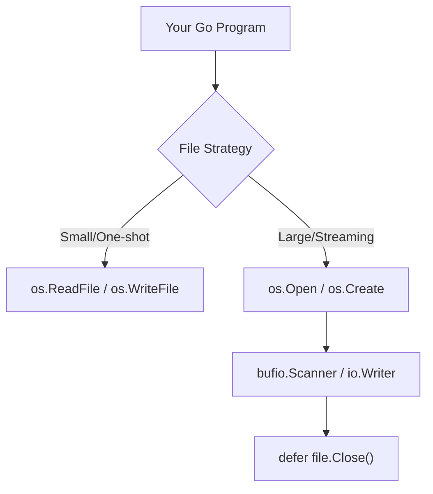

# FS.1 Files

## Mission

Learn how to open, read, write, and close files safely in Go, and understand the difference between one-shot operations and streaming I/O.

## Prerequisites

- `EN.6` config-parser-project

## Mental Model

Think of File I/O as **Using a Library**.

- **os.ReadFile**: "I'd like a photocopy of the entire book, please." You get everything at once, but if the book is 5,000 pages, your arms (RAM) will get tired.
- **os.Open + bufio.Scanner**: "I'll sit here and read one page at a time." You only need enough strength (RAM) to hold one page, no matter how long the book is.
- **os.Create / os.OpenFile**: "I'm going to write a new book" or "I'm going to add a chapter to this existing book."

## Visual Model



## Machine View

When you open a file, the operating system gives your program a **File Descriptor** (a small integer). This descriptor is a pointer to an entry in the kernel's internal "Open File Table." Because the OS has a limited number of descriptors it can hand out (often 1024 per process), you must always release them when you're done. In Go, we use `defer file.Close()` immediately after a successful open to ensure the descriptor is returned to the OS, even if the program panics or returns early.

## Run Instructions

```bash
go run ./05-packages-io/02-io-and-cli/filesystem/1-files
```

## Code Walkthrough

### `os.WriteFile` and `os.ReadFile`
These are helper functions for the 90% case where you just want to dump data to a file or read it all back. They handle the opening, closing, and error checking internally.

### `os.Open` and `os.Create`
These return an `*os.File` object, which represents an open file handle. You use these when you need more control, like reading line-by-line or writing incrementally.

### `bufio.Scanner`
Wraps a file handle and provides a convenient `Scan()` method to read the file one line at a time. It uses a fixed-size buffer (default 64KB), making it safe for files of any size.

### `os.OpenFile` with Flags
Allows you to specify exactly how the file should be opened. Common flags include `O_APPEND` (to add to the end) and `O_CREATE` (to make the file if it doesn't exist).

## Try It

1. Modify the `readLineByLine` function to count the total number of characters in the file.
2. Use `os.OpenFile` to create a simple logger that appends a timestamped message to a file every time it's called.
3. Try to read a file that doesn't exist and observe the error message.

## In Production
**Resource Leaks** are a common cause of production crashes. If you open a file in a loop and forget to close it, your program will eventually hit the "Too many open files" limit and crash. Always use `defer` for cleanup. Also, be mindful of file permissions (0644 for data files, 0755 for executables/directories) to ensure your app is secure.

## Thinking Questions
1. Why is it dangerous to use `os.ReadFile` on a multi-gigabyte log file?
2. What is a "File Descriptor," and why is it a finite resource?
3. What happens if you try to write to a file opened with `os.O_RDONLY`?

> [!TIP]
> You now know how to work with the contents of files. But how do you find those files and manage their names across different operating systems? In [Lesson 2: Paths](../2-paths/README.md), you will learn how to use the `path/filepath` package to handle file paths portably.

## Next Step

Next: `FS.2` -> [`05-packages-io/02-io-and-cli/filesystem/2-paths`](../2-paths/README.md)
