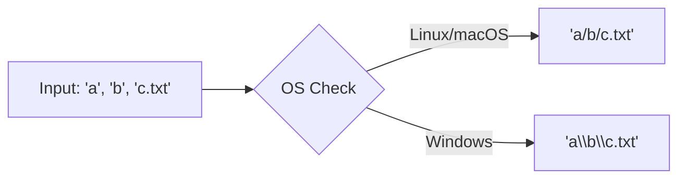

# FS.2 Paths

## Mission

Learn how to use the `path/filepath` package to manipulate file paths in a portable, OS-independent way.

## Prerequisites

- `FS.1` files

## Mental Model

Think of `path/filepath` as a **Universal GPS for Files**.

Different "Countries" (Operating Systems) use different "Signs" for roads. Linux and macOS use forward slashes (`/`), while Windows uses backslashes (`\`). If you try to give a Windows driver a map with Linux signs, they will get lost. `path/filepath` automatically translates your "Directions" into the local language of whatever computer your code is running on.

## Visual Model



## Machine View

Go provides two packages for paths: `path` and `path/filepath`.
- `path`: Always uses `/`. Use this ONLY for URL paths or internal virtual filesystems.
- `path/filepath`: Uses the OS-specific separator (`os.PathSeparator`). Use this for ALL local file operations.
The `filepath` package doesn't just swap slashes; it also handles "normalization" (removing redundant dots and resolving parent directory references) via `filepath.Clean`.

## Run Instructions

```bash
go run ./05-packages-io/02-io-and-cli/filesystem/2-paths
```

## Code Walkthrough

### `filepath.Join`
The gold standard for building paths. It takes any number of segments and joins them using the correct separator for the current OS. It also "cleans" the resulting path automatically.

### `filepath.Base`, `filepath.Dir`, and `filepath.Ext`
The "Deconstruction" tools. They let you extract specific parts of a path string without having to manually parse slashes or look for dots.

### `filepath.Abs`
Resolves a relative path (like `./config.yaml`) into a full, absolute path starting from the root of the filesystem. This is crucial when your program needs to pass a path to another process or log exactly where a file is located.

### `filepath.Clean`
Normalizes a path by removing redundant elements like `.` (current dir) and resolving `..` (parent dir). This is a vital security step when processing user-provided paths to prevent "Path Traversal" attacks.

## Try It

1. Use `filepath.Join` to build a path that goes up two levels and then into a `data` folder.
2. Extract the name of a file from a complex path without including its extension.
3. Compare the output of `filepath.Join` on your local machine with what you would expect on a different OS.

## In Production
**Never use string concatenation (`path + "/" + filename`) to build file paths.** This is the most common cause of cross-platform bugs in Go programs. Always use `filepath.Join`. Also, always `Clean` and `Abs` any paths provided by users before performing file operations to ensure they aren't trying to access files outside of your intended directory.

## Thinking Questions
1. Why does Go have two different path packages?
2. What is the difference between a relative path and an absolute path?
3. How does `filepath.Clean` help improve the security of your application?

> **Forward Reference:** You now know how to describe where files are. But how do you manage the "Containers" (directories) themselves, or find every file in a giant folder tree? In [Lesson 3: Directories](../3-dir/README.md), you will learn how to create, list, and walk through directory structures.

## Next Step

Continue to `FS.3` directories.
