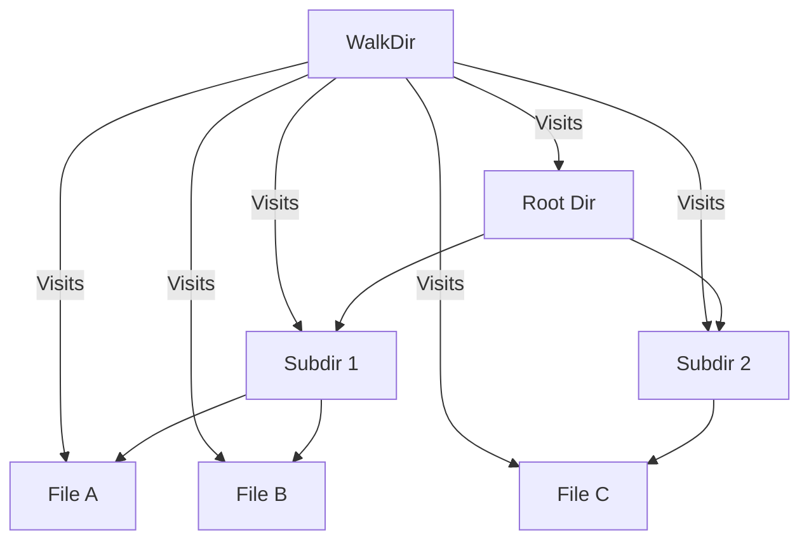

# FS.3 Directories

## Mission

Learn how to create, list, and recursively traverse directory structures, and understand how to check for the existence of files and folders.

## Prerequisites

- `FS.2` paths

## Mental Model

Think of Directories as **Filing Cabinets**.

- **os.Mkdir**: "I'm buying one new cabinet."
- **os.MkdirAll**: "I'm setting up an entire office floor, including the room and all the cabinets inside it."
- **os.ReadDir**: "I'm opening one drawer to see what's inside."
- **filepath.WalkDir**: "I'm doing a complete inventory of the entire building, floor by floor, room by room, drawer by drawer."

## Visual Model



## Machine View

In modern operating systems, a directory is a special type of file that contains a list of names and their corresponding metadata (like the "inode" number on Linux). When you call `os.ReadDir`, the OS reads this list into memory. `filepath.WalkDir` is a higher-level tool that performs a **Depth-First Search (DFS)** through the filesystem tree. It's much more efficient than the older `filepath.Walk` because it uses the `os.ReadDir` API which avoids unnecessary `Stat` calls for every file.

## Run Instructions

```bash
go run ./05-packages-io/02-io-and-cli/filesystem/3-dir
```

## Code Walkthrough

### `os.MkdirAll`
The safest way to create directories. It ensures the entire path exists, creating any missing parent folders along the way. It is **idempotent**, meaning it won't return an error if the directory already exists.

### `os.ReadDir`
Lists the contents of a single directory. It returns a slice of `DirEntry` objects, which contain the filename and whether it's a directory or a regular file.

### `filepath.WalkDir`
The powerhouse of filesystem navigation. You provide a root path and a callback function. Go will then call your function for every single file and folder it finds under that root. You can even tell it to skip specific subtrees by returning `filepath.SkipDir`.

### `os.Stat` and `os.IsNotExist`
The standard way to check if a file or folder exists. `os.Stat` returns information about a file; if the file is missing, it returns an error. You then use `os.IsNotExist(err)` to confirm that the error was specifically "not found."

## Try It

1. Use `filepath.WalkDir` to find all `.go` files in a large directory and print their names.
2. Create a nested directory structure that is 5 levels deep using a single `os.MkdirAll` call.
3. Write a function that checks if a directory exists and creates it only if it's missing.

## In Production
Directory traversal can be slow if the tree is very deep or stored on a network drive. When using `WalkDir`, be mindful of performance. Also, always handle errors in your callback-permission denied errors are common when walking system directories. Finally, use `os.RemoveAll` with extreme caution; it is destructive and cannot be undone.

## Thinking Questions
1. Why is `os.MkdirAll` usually preferred over `os.Mkdir`?
2. What is the difference between `os.ReadDir` and `filepath.WalkDir`?
3. How would you stop a `WalkDir` traversal as soon as you find the file you're looking for?

> **Forward Reference:** You've learned how to manage permanent files and folders. But what about data that only needs to exist for a few minutes? In [Lesson 4: Temp Files](../4-temp/README.md), you will learn how to create and manage temporary files and directories that clean themselves up.

## Next Step

Continue to `FS.4` temp.
