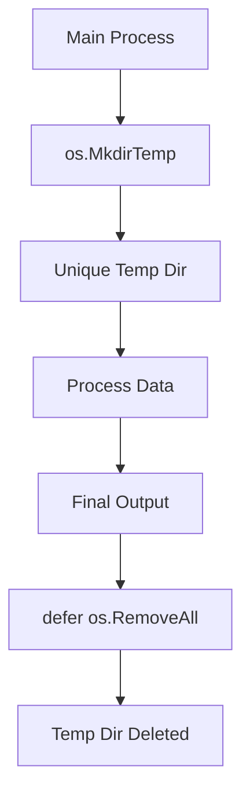

# FS.4 Temp Files

## Mission

Learn how to create secure, unique, and cross-platform temporary files and directories, and understand the importance of managing their lifecycle with `defer`.

## Prerequisites

- `FS.3` directories

## Mental Model

Think of Temp Files as **Draft Paper**.

Imagine you are working on a complex project. You need space to do some quick calculations or store intermediate data that you won't need once the project is finished. You reach for a "Draft Pad" (the OS temp directory). You get a clean, unique sheet of paper that no one else can see or use. When you're done, you crumple it up and throw it in the recycle bin (`defer os.RemoveAll`).

## Visual Model



## Machine View

When you call `os.CreateTemp("", "data-*.csv")`, the Go runtime performs several steps:
1. It identifies the system's default temporary directory (e.g., `/tmp` on Linux, `C:\Users\...\Temp` on Windows).
2. It generates a random string to replace the `*` in your pattern.
3. It attempts to create the file with restrictive permissions (`0600`-read/write for the owner only).
4. If a file with that name already exists, it tries again with a different random string until it succeeds (preventing "Race Conditions").
5. It returns an open `*os.File` handle ready for use.

## Run Instructions

```bash
go run ./05-packages-io/02-io-and-cli/filesystem/4-temp
```

## Code Walkthrough

### `os.MkdirTemp` and `os.CreateTemp`
These are the primary tools for creating temporary resources. The first argument is the parent directory (use `""` for the system default), and the second is a naming pattern.

### `pattern` with `*`
The `*` in the pattern is replaced by a random string of characters. This guarantees that your file name is unique and cannot be predicted by other programs on the system.

### `defer os.RemoveAll`
The most important line. Temporary files are stored on disk, and if you don't delete them, they will eventually fill up the user's storage. Using `defer` ensures that the files are cleaned up no matter how your program exits.

## Try It

1. Create a temporary file, write some text to it, and then print the full path to the terminal.
2. Modify the program to leave the temporary directory on disk (remove the `defer`) and verify its existence manually.
3. Create a "Cleanup Monitor" that lists all files in a temporary directory before deleting it.

## In Production
Never hardcode paths like `/tmp/my-app-lock`. This is a major security risk (allowing "Symlink Attacks") and a cause of bugs if multiple instances of your app run at once. Always use `os.CreateTemp`. Also, remember that on many systems, files in `/tmp` are deleted automatically when the computer reboots, but you should still always clean up after yourself during the program's execution.

## Thinking Questions
1. Why is the `*` in the pattern essential for security?
2. What is the difference between `os.Remove` and `os.RemoveAll` when cleaning up a temp directory?
3. When would you want to create a temp file in a specific directory instead of the system default?

> [!TIP]
> You've learned how to handle files on the disk. But what if you want to include files *inside* your compiled binary? In [Lesson 5: Embed](../5-embed/README.md), you will learn how to use Go's `embed` package to bundle assets directly into your application.

## Next Step

Next: `FS.5` -> [`05-packages-io/02-io-and-cli/filesystem/5-embed`](../5-embed/README.md)
