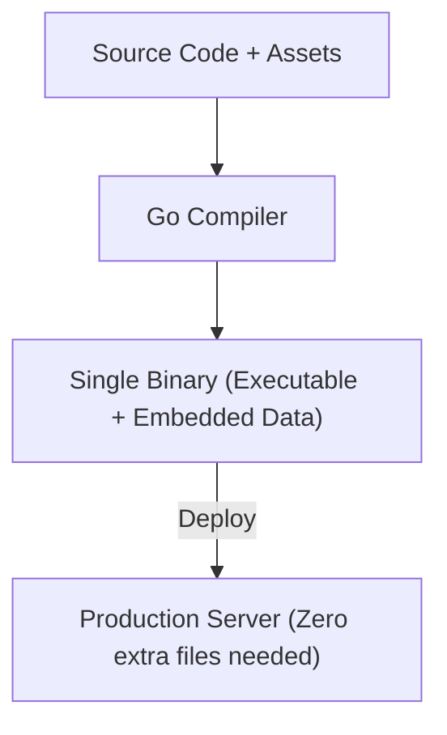

# FS.5 Embed

## Mission

Learn how to use the `//go:embed` directive to bundle static assets (like text files, images, or templates) directly into your Go binary, enabling single-file distribution of your applications.

## Prerequisites

- `FS.4` temp-files

## Mental Model

Think of Embedding as **Building a Backpack into your Suit**.

Instead of carrying a separate bag (external files) that you might forget at home, you sew the pockets directly into your jacket. Wherever you go (wherever your binary is deployed), you are guaranteed to have your tools (your assets) with you, exactly where you expect them to be.

## Visual Model



## Machine View

The `//go:embed` directive is a compiler instruction. During the build process, the Go compiler reads the specified files from your disk and includes their raw byte data inside a special data segment of the resulting executable binary. When your program runs, it doesn't look at the disk; it reads the data directly from its own process memory. This means your app will work even if the original source files are deleted from the server where it's running.

## Run Instructions

```bash
go run ./05-packages-io/02-io-and-cli/filesystem/5-embed
```

## Code Walkthrough

### `//go:embed` Directive
Placed immediately above a variable declaration. It tells the compiler which files to include. Note that you must import the `embed` package (even if just with `_ "embed"`) for the directive to work.

### Embedding as `string` or `[]byte`
The simplest way to embed a single file. Go automatically converts the file contents into the target type.

### `embed.FS`
A virtual filesystem that can hold multiple files and directories. It implements the standard `io/fs` interfaces, meaning you can use it with many other Go packages (like `html/template` or `http.FileServer`) as if it were a real disk directory.

## Try It

1. Create a new folder `assets`, put a text file inside it, and embed the entire folder using `embed.FS`.
2. Try to embed a file that doesn't exist and observe the compiler error.
3. Use `staticFiles.ReadDir` to list all the files you've embedded in the `public` directory.

## In Production
Embedding increases the size of your binary. If you embed a 100MB video file, your executable will be at least 100MB larger. For very large assets, traditional disk storage or a CDN is still preferred. However, for configuration defaults, SQL migration files, and web templates, embedding is the professional standard in Go.

## Thinking Questions
1. Why does embedding make deployment easier?
2. What are the limitations of what can be embedded (e.g., can you embed files from a parent directory)?
3. How would you use `embed.FS` to serve a static website from a single Go binary?

> [!TIP]
> You've learned the mechanics of files and directories. Now we will look at the higher-level design patterns used to move data between them. In [Lesson 6: IO Patterns](../6-io-patterns/README.md), you will learn about the powerful `io.Reader` and `io.Writer` interfaces.

## Next Step

Next: `FS.6` -> [`05-packages-io/02-io-and-cli/filesystem/6-io-patterns`](../6-io-patterns/README.md)
