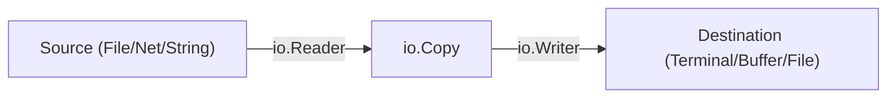

# FS.6 IO Patterns

## Mission

Master Go's most powerful interfaces, `io.Reader` and `io.Writer`, and learn how to compose them to build efficient data processing pipelines.

## Prerequisites

- `FS.5` embed

## Mental Model

Think of `io.Reader` and `io.Writer` as **Standardized Pipes and Connectors**.

- **Reader**: A pipe where data flows **OUT**.
- **Writer**: A pipe where data flows **IN**.
- **io.Copy**: The **Universal Connector** that joins any Reader to any Writer.

Because the connectors are standardized, you can connect a "File Pipe" to a "Network Pipe," or a "String Pipe" to a "Compression Pipe," without needing to know anything about the data itself.

## Visual Model



## Machine View

The power of `io.Reader` and `io.Writer` lies in their simplicity:
- `Read(p []byte) (n int, err error)`: Fill this slice with data.
- `Write(p []byte) (n int, err error)`: Empty this slice into the destination.
Because these methods only use a byte slice, they are extremely memory-efficient. You can move 10 gigabytes of data from a disk to a network socket using a tiny 32KB buffer, piping it through a `TeeReader` or `MultiWriter` along the way, without ever loading more than 32KB into RAM at a single time.

## Run Instructions

```bash
go run ./05-packages-io/02-io-and-cli/filesystem/6-io-patterns
```

## Code Walkthrough

### `strings.Reader` and `bytes.Buffer`
Common implementations of the I/O interfaces. Use `strings.Reader` when you have a string but need to pass it to a function that expects an `io.Reader`. Use `bytes.Buffer` as an in-memory scratchpad that can be both read from and written to.

### `io.Copy`
The workhorse of Go I/O. It efficiently streams data from a source to a destination until the source hits `EOF`.

### `io.TeeReader`
Creates a "Splitter". It returns a reader that, whenever it is read from, also writes that same data to a secondary writer. Perfect for logging data as it's being processed.

### `io.MultiReader` and `io.MultiWriter`
"Concatenators" and "Duplicators." `MultiReader` treats several readers as one long sequence. `MultiWriter` sends every write to multiple destinations (like a file AND the terminal) simultaneously.

## Try It

1. Create a `MultiWriter` that writes to two different `bytes.Buffer` objects.
2. Use `io.Copy` to "pipe" the contents of one file into another.
3. Implement a custom `io.Writer` that only prints every second byte it receives.

## In Production
I/O operations are almost always the slowest part of your application (compared to CPU or RAM). Using the streaming interfaces correctly is the difference between an app that can handle 10,000 users and one that crashes as soon as the data gets large. Avoid `io.ReadAll` for large or untrusted inputs; always prefer streaming with `io.Copy` or `io.LimitReader`.

## Thinking Questions
1. Why is `io.Copy` considered "memory-constant"?
2. What happens if you try to `Read` from a reader that has already reached the end of its data?
3. How can you use `io.MultiWriter` to implement a "Debug Log" that only writes to the console if a flag is set?

> **Forward Reference:** You have mastered the building blocks of Go I/O. It's time to build a real-world tool that uses these patterns to solve a practical problem. In [Lesson 7: Log Search Project](../7-log-search/README.md), you will build a high-performance log searching tool using optimized I/O patterns.

## Next Step

Next: `FS.7` -> `05-packages-io/02-io-and-cli/filesystem/7-log-search`

Open `05-packages-io/02-io-and-cli/filesystem/7-log-search/README.md` to continue.
