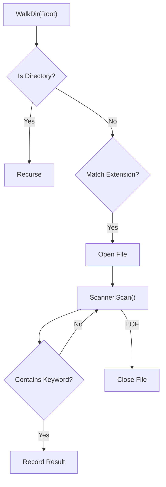

# FS.7 Log Search Project

## Mission

Build a professional log searching tool that recursively traverses directory trees and scans files line-by-line using constant memory, even when searching through gigabytes of data.

## Prerequisites

- `FS.1` files
- `FS.3` directories
- `FS.6` io-patterns

## Mental Model

Think of this tool as a **High-Speed Sorter on a Warehouse Floor**.

1. **Navigation**: The tool walks through the warehouse (the directory tree).
2. **Filtering**: It only stops to look at specific boxes (files with `.log` or `.txt` extensions).
3. **Scanning**: For each box, it reads the labels (lines) one by one. It doesn't open every box at once; it only looks at what it can hold in its hands (the `bufio.Scanner` buffer).
4. **Reporting**: If a label matches its search criteria, it writes down the location (file path and line number).

## Visual Model



## Machine View

This project utilizes the most efficient I/O patterns available in Go. `filepath.WalkDir` is used because it is "stat-lazy," meaning it only requests file metadata from the OS when absolutely necessary, significantly speeding up traversal on large filesystems. `bufio.Scanner` is used for the actual file searching because it reads data in buffered chunks, ensuring that your program's memory usage stays flat regardless of whether you are searching a 10KB or a 10GB file.

## Run Instructions

```bash
go run ./05-packages-io/02-io-and-cli/filesystem/7-log-search
```

## Solution Walkthrough

- **filepath.WalkDir**: Recursively visits every file and folder. We use the `DirEntry` to skip subdirectories and check file extensions before opening any file handles.
- **bufio.Scanner**: The core of the search logic. It reads the file line-by-line, which is much safer and more efficient than `os.ReadFile` for large log files.
- **strings.Contains and strings.ToLower**: Implement a simple case-insensitive search by normalizing both the line content and the keyword to lowercase before comparison.
- **Error Handling**: In a filesystem tool, errors are expected (e.g., permission denied). Instead of crashing, our tool logs the warning to `os.Stderr` and continues searching the rest of the files.

## Try It

1. Modify the tool to accept the search directory and keyword as command-line arguments (using `os.Args` or the `flag` package).
2. Add a `--limit` flag to stop searching after a certain number of matches are found.
3. Update the filter to include more file extensions (e.g., `.yaml`, `.json`).

## Verification Surface

- Use `go run ./05-packages-io/02-io-and-cli/filesystem/7-log-search`.
- Starter path: `05-packages-io/02-io-and-cli/filesystem/7-log-search/_starter`.


## In Production
Searching large filesystems can put significant pressure on disk I/O. In a production monitoring system, you would typically use a specialized indexing tool (like **Elasticsearch** or **Grafana Loki**) rather than raw filesystem scanning. However, for quick debugging and local tools, this pattern is incredibly powerful and efficient.

## Thinking Questions
1. Why is `filepath.WalkDir` faster than the older `filepath.Walk`?
2. How does `bufio.Scanner` help prevent Out-Of-Memory (OOM) errors?
3. What are the pros and cons of implementing a case-insensitive search by converting everything to lowercase?

> [!TIP]
> You've built a powerful tool that interacts with the real filesystem. But how do you test such a tool without actually creating and deleting files on your hard drive every time? In [Lesson 8: FS Testing Seam](../8-fs-testing-seam/README.md), you will learn how to use interfaces to create "Mock" filesystems for testing.

## Next Step

Next: `FS.8` -> [`05-packages-io/02-io-and-cli/filesystem/8-fs-testing-seam`](../8-fs-testing-seam/README.md)
