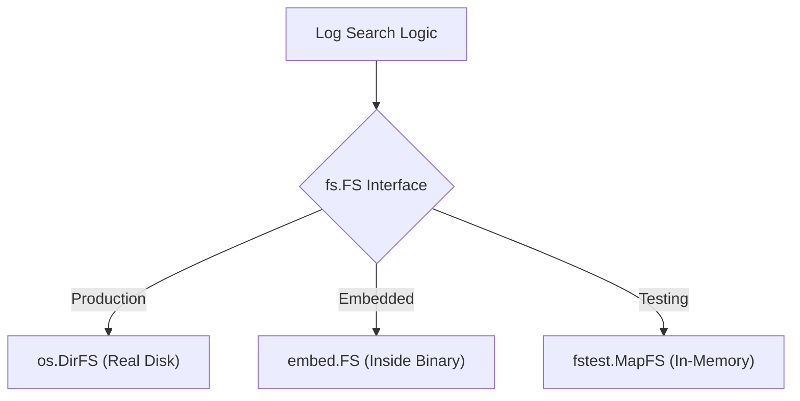

# FS.8 FS Testing Seam

## Mission

Learn how to decouple your code from the physical disk using the `io/fs` package, enabling you to write lightning-fast tests that run entirely in memory using `fstest.MapFS`.

## Prerequisites

- `FS.7` log-search-project

## Mental Model

Think of `fs.FS` as a **Universal Adapter for Storage**.

Before, your code was "Hard-Wired" to the house's electricity (the physical disk). If you wanted to test it, you had to be at the house. By using `fs.FS`, you've changed your code to use a "Battery Adapter." Now, in production, you can still plug it into the wall (`os.DirFS`), but in testing, you can use a portable battery (`fstest.MapFS`) and run your code anywhere, even in a vacuum with no disk I/O at all.

## Visual Model



## Machine View

The `io/fs` package defines the `FS` interface, which has a single method: `Open(name string) (File, error)`. Because this interface is so simple, almost anything can implement it.
- `os.DirFS(".")` creates an implementation that maps calls to your local disk.
- `fstest.MapFS` creates an implementation that maps calls to a `map[string]*fstest.MapFile` in memory.
When your code calls `fs.WalkDir` or `fsys.Open`, it doesn't know (or care) where the bytes are coming from. This is the ultimate form of "Inversion of Control" for filesystem operations.

## Run Instructions

```bash
go run ./05-packages-io/02-io-and-cli/filesystem/8-fs-testing-seam
```

## Code Walkthrough

### `SearchLogs(fsys fs.FS, ...)`
Notice the signature of this function. It doesn't take a directory path string; it takes an `fs.FS` interface. This is the "Seam" that allows us to swap the filesystem implementation.

### `os.DirFS(".")`
Used in the `main` function to provide a real view of the current directory to our logic.

### `fstest.MapFS` (in tests)
Inside the `main_test.go` (if provided) or in your own tests, you would define a `MapFS` with a few dummy files. This allows you to verify your search logic without actually creating files on your hard drive, making your tests faster, safer, and more reliable.

### `fs.WalkDir`
A generic version of `filepath.WalkDir` that works on any `fs.FS`. It allows you to traverse any virtual or physical folder tree using the same consistent API.

## Try It

1. Write a small test (or a separate main function) that uses `fstest.MapFS` to search for a string in a virtual log file.
2. Use `embed.FS` (from the previous lesson) as the input to `SearchLogs`.
3. Implement a custom `fs.FS` that always returns an error when `Open` is called, and see how your `SearchLogs` function handles it.

## In Production
The `fs.FS` interface is **read-only**. It is perfect for reading configurations, templates, and logs. However, if you need to **write** files, you will still need to use the `os` package or define your own "Writable Filesystem" interface. For 90% of reading tasks, however, `fs.FS` is the modern Go standard.

## Thinking Questions
1. Why is code that accepts interfaces easier to test than code that uses global state or hardcoded paths?
2. What are the advantages of using `fstest.MapFS` over `os.MkdirTemp` for unit tests?
3. How does the "Accept interfaces, return structs" rule apply to the design of `SearchLogs`?

> **Forward Reference:** You have mastered Section 05: Packages and I/O. You now know how to build modules, handle CLI arguments, encode data, and manage filesystems with professional patterns. You are ready to move on to the next major pillar of Go engineering. In [Section 06: Backend & DB](../../../../06-backend-db/README.md), you will learn how to build high-performance web servers and interact with SQL databases.

## Next Step

Continue to `HS.1` http-server.
