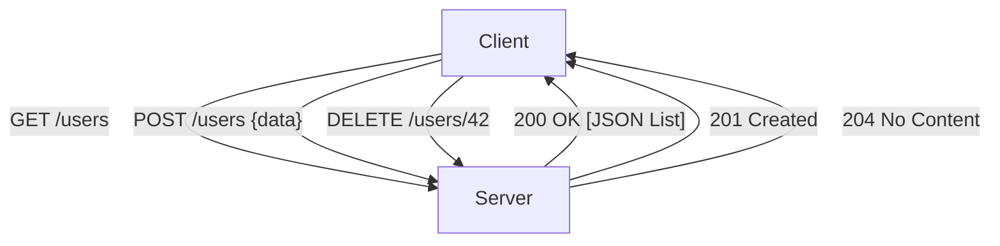

# API.1 REST design principles

## Mission

Understand the architectural constraints of REST (Representational State Transfer) and learn how to design clean, resource-oriented APIs that are easy for other developers to use.

## Prerequisites

- `HS.10` rest-api-exercise

## Mental Model

Think of REST as **The Standard Library Catalog System**.

1. **The Nouns (Resources)**: Every item in the library (Book, Author, Member) has a unique address (a URL).
2. **The Actions (Verbs)**: You don't ask the librarian for "the-action-of-taking-a-book". Instead, you use a standard gesture:
    - **GET**: Show me the book.
    - **POST**: Add a new book to the shelf.
    - **PUT**: Replace a damaged book with a new copy.
    - **DELETE**: Remove the book from the collection.
3. **Uniform Interface**: No matter which library you go to in the world, the "Search" and "Borrow" gestures are the same. This makes the system predictable.

## Visual Model



## Machine View

REST is an architectural style, not a protocol. It runs on top of HTTP. The key machine-level concept is **Statelessness**. The server does not store any "session" data about the client. Every request must contain all the information necessary to understand and process that request (like an Auth token in the header). This allows the server to be highly scalable-any instance of your app can handle any request from any client at any time.

## Run Instructions

```bash
go run ./06-backend-db/01-web-and-database/apis/1-rest-design-principles
```

This lesson is a conceptual guide. Read the console output for a summary of naming rules.

## Code Walkthrough

### Resources as Nouns
In REST, the URL identifies **What** you are talking about, not **What you are doing**.
- ❌ `/getUsers`
- ✅ `/users`

### HTTP Verbs as Actions
We use the underlying HTTP methods to describe the operation:
- `GET`: Retrieve data (Safe, Idempotent).
- `POST`: Create data (Non-idempotent).
- `PUT`: Update/Replace data (Idempotent).
- `PATCH`: Partial update.
- `DELETE`: Remove data (Idempotent).

### Idempotency
An operation is **Idempotent** if performing it multiple times has the same effect as performing it once. `GET`, `PUT`, and `DELETE` should be idempotent. `POST` is not-calling it twice creates two resources.

### Status Codes
Use the right tool for the job:
- `200 OK`: Success.
- `201 Created`: Successfully created a resource.
- `400 Bad Request`: Client sent bad data.
- `401 Unauthorized`: Client needs to log in.
- `403 Forbidden`: Client is logged in but doesn't have permission.
- `404 Not Found`: The resource doesn't exist.
- `500 Internal Server Error`: Your code crashed.

## Try It

1. Look at your favorite API (GitHub, Stripe, etc.) and identify their resource naming patterns.
2. Design the URL structure for a "Music Streaming" service (Songs, Playlists, Artists).
3. Think about how you would handle an action that doesn't fit a noun (like `/login` or `/search`).

## In Production
While "Pure REST" (HATEOAS) is a popular academic topic, most production APIs follow "Pragmatic REST." This means focus on clean URLs, correct verbs, and consistent JSON shapes, but don't obsess over hypermedia links unless your use case strictly requires it. **Consistency** is more important than "perfect" REST adherence.

## Thinking Questions
1. Why is statelessness important for scaling a web server?
2. When should you use `PUT` vs `PATCH`?
3. Is it okay to use `GET` to delete a resource if it's easier to implement? (Hint: No! Think about web crawlers).

> **Forward Reference:** Your API is well-designed, but what happens when you need to change the data structure without breaking existing mobile apps? In [Lesson 2: API Versioning Strategies](../2-api-versioning-strategies/README.md), you will learn how to evolve your API safely.

## Next Step

Next: `API.2` -> `06-backend-db/01-web-and-database/apis/2-api-versioning-strategies`

Open `06-backend-db/01-web-and-database/apis/2-api-versioning-strategies/README.md` to continue.
