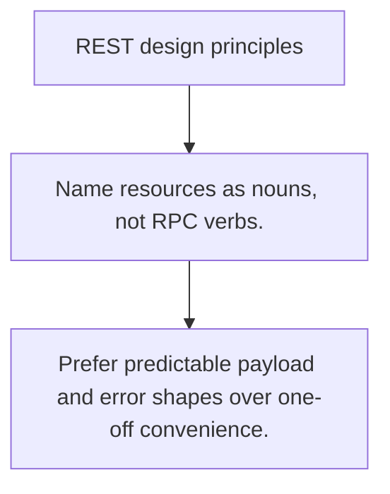

# API.1 REST design principles

## Mission

Learn the resource-oriented rules that make REST APIs predictable for humans and clients.

## Prerequisites

- none

## Mental Model

REST is mostly naming discipline and uniform HTTP semantics, not a framework.

## Visual Model



## Machine View

URLs, verbs, status codes, and payloads must align so clients can infer behavior from the contract.

## Run Instructions

```bash
go run ./06-backend-db/01-web-and-database/apis/1-rest-design-principles
```

## Code Walkthrough

### Name resources as nouns, not RPC verbs.

Name resources as nouns, not RPC verbs.

### Let HTTP verbs express the action when possible.

Let HTTP verbs express the action when possible.

### Prefer predictable payload and error shapes over one-o

Prefer predictable payload and error shapes over one-off convenience.

## Try It

1. Change one of the example inputs and rerun the lesson.
2. Explain which boundary the lesson is trying to make explicit.
3. Describe how you would apply API.1 in a small service or tool.

## ⚠️ In Production

API consistency saves more engineering time than clever endpoint naming ever will.

## 🤔 Thinking Questions

1. What problem does this topic solve?
2. What breaks if this boundary is handled implicitly instead of explicitly?
3. Where would you expect to use this topic in production Go code?

## Next Step

Continue to `API.2`.
