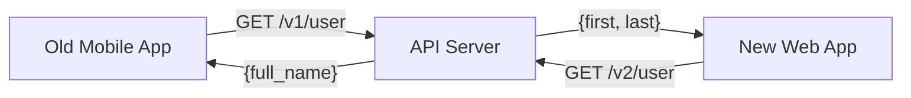

# API.2 API versioning strategies

## Mission

Learn how to manage the lifecycle of your API by implementing versioning strategies that allow you to evolve your codebase without breaking existing client integrations.

## Prerequisites

- `API.1` rest-design-principles

## Mental Model

Think of API versioning as **Maintaining Multiple Versions of a Legal Contract**.

1. **The Original Contract (v1)**: You signed a contract with your clients (mobile apps, web apps) saying: "I will provide a `full_name` field."
2. **The Update (v2)**: Later, you realize you need `first_name` and `last_name` separately.
3. **The Problem**: If you just change the field, the mobile app (which only knows how to read `full_name`) will break.
4. **The Solution**: You keep the v1 contract active for old clients, and offer the v2 contract for new clients. Both versions run in the same "building" (server) at the same time.

## Visual Model



## Machine View

At the code level, versioning usually involves either URL path segments or HTTP headers.
- **URL Versioning** (`/v1/...`) is the most common. It makes it very clear to intermediate systems (like CDNs and Load Balancers) that these are different resources, which simplifies caching.
- **Header Versioning** (`Accept: version=2`) keeps URLs "clean" but makes debugging and caching more complex.
Regardless of the method, the goal is to route the request to a different handler or logic path that understands the expected data shape for that specific version.

## Run Instructions

```bash
go run ./06-backend-db/01-web-and-database/apis/2-api-versioning-strategies
```

Test the two versions:
```bash
# Get the legacy V1 shape
curl http://localhost:8089/v1/user

# Get the modern V2 shape
curl http://localhost:8089/v2/user
```

## Code Walkthrough

### Structured Versioning
In the example, we define two different structs: `UserV1` and `UserV2`. This is the safest way to version. Even if the internal database structure changes, you can write conversion logic to map the new database fields back to the old `UserV1` JSON shape.

### Route Multiplexing
We use the `http.ServeMux` to handle routing. By including the version in the route path (`/v1/user`), we explicitly separate the two contracts.

### Breaking vs. Non-Breaking
- **Breaking**: Removing a field, changing a type, renaming a field, changing the URL.
- **Non-Breaking**: Adding a new optional field, adding a new endpoint.
**Rule of Thumb**: If a client needs to change their code to keep working, it's a breaking change and requires a new version.

## Try It

1. Create a "Global Versioning" middleware that adds a `Warning: Deprecated` header to all `/v1` requests.
2. Implement a versioning scheme using a query parameter (e.g., `/user?v=1`) and see how the code changes.
3. Add a new field to `UserV2` and verify that `UserV1` clients are unaffected.

## In Production
Supporting many versions forever is expensive. Most professional APIs have a **Deprecation Policy**. For example: "We support v1 for 12 months after v2 is released." You should track the usage of old versions and proactively reach out to clients who are still using deprecated endpoints. Tools like **OpenAPI (Swagger)** can help document these transitions clearly.

## Thinking Questions
1. Why is URL versioning generally preferred over Header versioning for public APIs?
2. How would you handle a bug fix that needs to be applied to all versions simultaneously?
3. What is the danger of having too many active versions (e.g., v1 through v15)?

> [!TIP]
> You can now version your API. But as your data grows, you can't return all 1,000,000 users in a single request. In [Lesson 3: Pagination and Filtering](../3-pagination-and-filtering/README.md), you will learn how to handle large datasets efficiently.

## Next Step

Next: `API.3` -> [`06-backend-db/01-web-and-database/apis/3-pagination-and-filtering`](../3-pagination-and-filtering/README.md)
